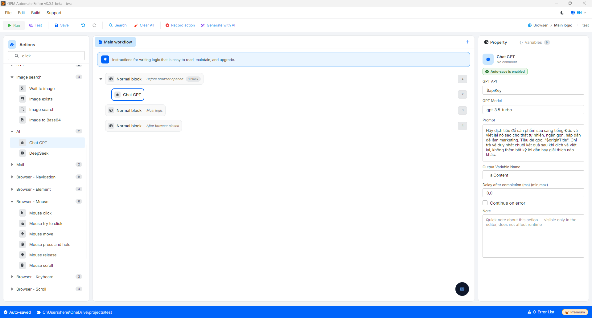

# ChatGPT

Chat GPT 是内置的动作,可以让你的脚本通过 API 协议直接与 OpenAI 的大型语言模型进行交流。这个动作让 Automation 脚本变得格外智能,凭借自动处理自然语言、翻译、文本摘要、信息提取,或在运行流程中自动创作文章内容的能力。

#### 第一步:注册账号并购买 OpenAI 上的 Credits(API)

与 ChatGPT Plus 账号(网页界面使用的每月 $20 付费套餐)不同,使用 API 的账号运行机制为预先充值,用多少扣多少(Pay-as-you-go)。

1. 注册账号:你访问 OpenAI 面向开发者的页面,地址为 [https://platform.openai.com](https://platform.openai.com/),然后进行账号注册(使用 Email 或直接与 Google 账号关联)。
2. 充值购买 API:
   * 在管理界面中,你找到 Settings ➔ Billing 选项。
   * 点击选择 Add credits(或 Set up payment)来关联你的国际支付卡(Visa/Mastercard)。
   * 向账号中充值一笔最低金额(通常是 $5)。这笔金额会根据你的脚本向 AI 发送和接收的文本字符数量(Token)逐步扣除。

#### 第二步:创建并获取 API Key 密钥(GPT API)

API Key 密钥的作用相当于一把安全钥匙,帮助 GPM Automate 连接并使用你刚刚充值的金额来调用 AI 处理工作。

1. 在 OpenAI Platform 界面左侧的菜单栏中,你访问 API Keys 选项。
2. 点击 Create new secret key(创建新的密钥)按钮。
3. 给这把钥匙起一个易记的名称(例如:`GPM_Automate_Key`)。
4.  系统会显示一串以 `sk-...` 开头的长字符串。

    > ⚠️ 注意:请立即将此密钥复制并保存到一个安全的文件中,因为 OpenAI 只会显示这串字符一次。如果丢失,你将必须创建一把新的密钥。

#### 第三步:获取准确的 Model 名称列表(GPT Model)

OpenAI 提供了许多不同速度、成本和智能程度的 AI 世代。为了将 Model 名称准确填入 GPM Automate:

访问 OpenAI Platform 页面上的 Models 选项,在这里查看列表:[https://developers.openai.com/api/docs/models/all](https://developers.openai.com/api/docs/models/all)。或快速查看下方最常用的 Model 列表:

| **Model 名称(填入 GPM 中)** | **特点与推荐使用场景**                                                                                                               |
| ---------------------------- | ---------------------------------------------------------------------------------------------------------------------------------------- |
| gpt-4o-mini                  | 新一代 Model,响应速度极快,token 成本极其低廉,最适合用于常规的 Automation 任务。               |
| gpt-4o                       | 目前最智能的 Model,在处理数学逻辑、编程或深度内容撰写方面表现极其出色,但成本更高。 |
| gpt-3.5-turbo                | 传统 Model,智能程度处于基础水平,能很好地处理翻译或简单的文本清理任务。                         |

#### 配置参数说明:

* GPT API:填入从你的 OpenAI 账号管理页面创建的密钥(Secret Key API)(字符串通常以 `sk-...` 开头)。
* GPT Model:填入你想使用的人工智能模型的标识名称,例如:`gpt-3.5-turbo`、`gpt-3.5-turbo-0125`、`gpt-4o`……
* Prompt:填入你想让 ChatGPT 处理和回答的问题、上下文或详细要求。你完全可以在此字段中嵌入从浏览器抓取的数据变量,让 AI 进行分析。
* Output variable:用于保存 ChatGPT 返回的完整回答文本字符串的变量名称。

#### 实际示例:自动翻译并重写文章标题(Rewrite Title)以规避版权

当你从事 Marketing、POD 或在国际市场(例如德国市场)制作内容时,你需要从电商网站上抓取以英文书写的商品标题,然后翻译成德语并稍作重写,以发布到你自己的商店中,从而优化 SEO 并避免内容重复。

* 配置方法:
  * 假设你已经抓取到了英文原始标题,并保存在变量 `$originTitle` 中。
  * 在脚本中调用 Chat GPT 动作。
  * GPT API:`sk-proj-xxxxxxxxxxxxxxxxxxxx`
  * GPT Model:`gpt-3.5-turbo`
  *   Prompt:你填入给 AI 的指令内容:

      ```
      Hãy dịch tiêu đề sản phẩm sau sang tiếng Đức và viết lại nó sao cho thật tự nhiên, ngắn gọn, hấp dẫn để làm marketing. Tiêu đề gốc: "$originTitle". Chỉ trả về duy nhất chuỗi kết quả sau khi dịch và viết lại, không thêm bất kỳ lời dẫn hay giải thích nào khác.
      ```
  * Output variable:将输出变量命名为 `aiContent`。

结果:系统会将变量 `$originTitle` 中的标题发送给 ChatGPT 处理。AI 会迅速将其翻译并优化为德语措辞,然后将最精简的文本结果直接存入变量 `$aiContent` 中。在接下来的步骤中,你只需调用这个 `$aiContent` 变量,即可自动填入你网站上的输入框中,帮助实现极其专业的跨境内容制作流程自动化。

<figure><figcaption></figcaption></figure>