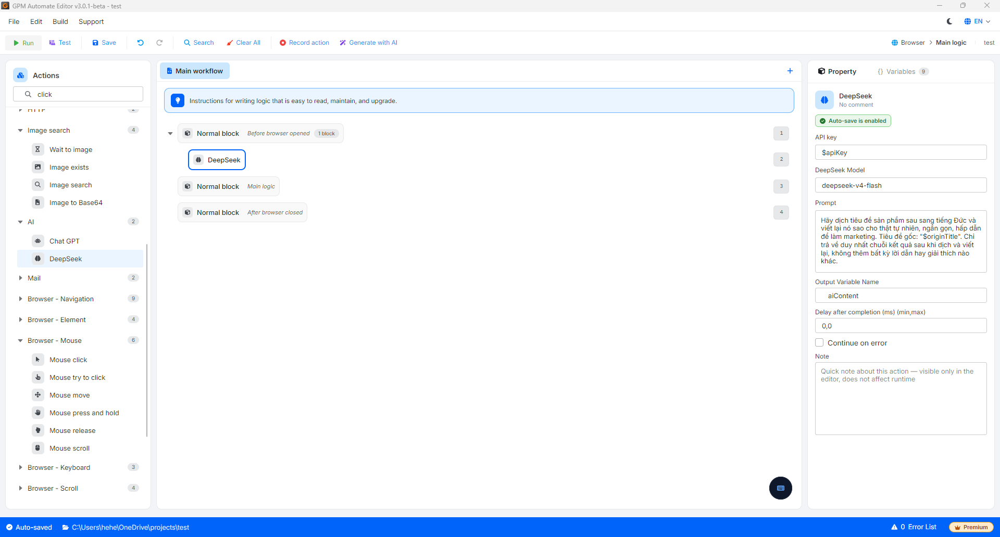

# DeepSeek

DeepSeek is a built-in action that allows your GPM Automate scripts to connect directly to the DeepSeek API system. With its outstanding advantages of ultra-low cost and logical thinking, programming, and extremely powerful language capabilities, this action is a perfect alternative or complement alongside Chat GPT for automating content creation tasks, data analysis, or intelligent text processing.

🎥 Watch the tutorial video: [Here](https://youtu.be/ir5gNwWHYdg).

#### Instructions for registering, purchasing API, and configuring the DeepSeek action

The operation mechanism and cost calculation via the DeepSeek API are similar to OpenAI (Prepaid, use as much as you deduct). The specific setup process includes the following steps:

**Step 1: Register an account and Top up (API Credits)**

1. You visit the official API management page of DeepSeek at: [https://platform.deepseek.com](https://platform.google.com/url?q=https://platform.deepseek.com) and create an account.
2. After logging in, go to the Top up or Billing section to link an international payment card (Visa/Mastercard) and top up the desired amount (usually a minimum of $2 - $5) to activate the API usage quota.

**Step 2: Initialize and obtain the DeepSeek API Key**

1. In the left menu, select the API Keys section.
2. Click on the Create new secret key button, name the key (e.g., `GPM_DeepSeek_Key`).
3. The system will display a long security string starting with `sk-...`. You should Copy and save it immediately as this string will be hidden and not displayed again.

**Step 3: Obtain the list of accurate Model names**

DeepSeek provides two extremely optimized core models; you just need to enter one of the two identifier codes accurately into the configuration field of GPM. You can view the list of DeepSeek models here: [https://api-docs.deepseek.com/quick\_start/pricing](https://api-docs.deepseek.com/quick_start/pricing).

#### Configuration parameters in GPM Automate:

When dragging the DeepSeek action into the Main workflow, you set it up as follows:

* API Key: Paste the secret key `sk-...` obtained in Step 2 here (or pass it through a variable for security).
* DeepSeek Model: Enter the exact string `deepseek-chat` or `deepseek-reasoning`.
* Prompt: Enter the content of your command or detailed request (e.g., `"Please analyze the following conversation and extract the customer's phone number: $webContent"`).
* Output variable: Name the output variable (e.g., `deepseekResult`) so that the system automatically saves the AI's response text string, ready for subsequent data entry actions.

#### Practical example: Automatically translating and rewriting article titles (Rewrite Title) to avoid copyright

When you do Marketing, POD, or content creation in the international market (for example, the German market), you need to scrape product titles from English E-commerce sites, then translate them into German and rewrite them a bit to post on your store to optimize SEO and avoid duplicate content.

* Configuration method:
  * Suppose you have scraped the original English title and saved it into the variable `$originTitle`.
  * Call the DeepSeek action in the script.
  * API Key: `sk-proj-xxxxxxxxxxxxxxxxxxxx`
  * DeepSeek Model: `deepseek-v4-flash`
  * Prompt: You enter the directive content for the AI:

      ```
      Please translate the following product title into German and rewrite it to be as natural, concise, and appealing as possible for marketing. Original title: "$originTitle". Only return the result string after translation and rewriting, without adding any leading or explanatory words.
      ```
  * Output variable: Name the output variable as `aiContent`.

Result: The system will push the title in the variable `$originTitle` to DeepSeek for processing. The AI will quickly translate and optimize the wording into German, then load the most concise text result directly into the variable `$aiContent`. In the next steps, you just need to call this variable `$aiContent` to automatically fill in the input field on your website, helping to automate the cross-border content creation process extremely professionally.

<figure><figcaption></figcaption></figure>