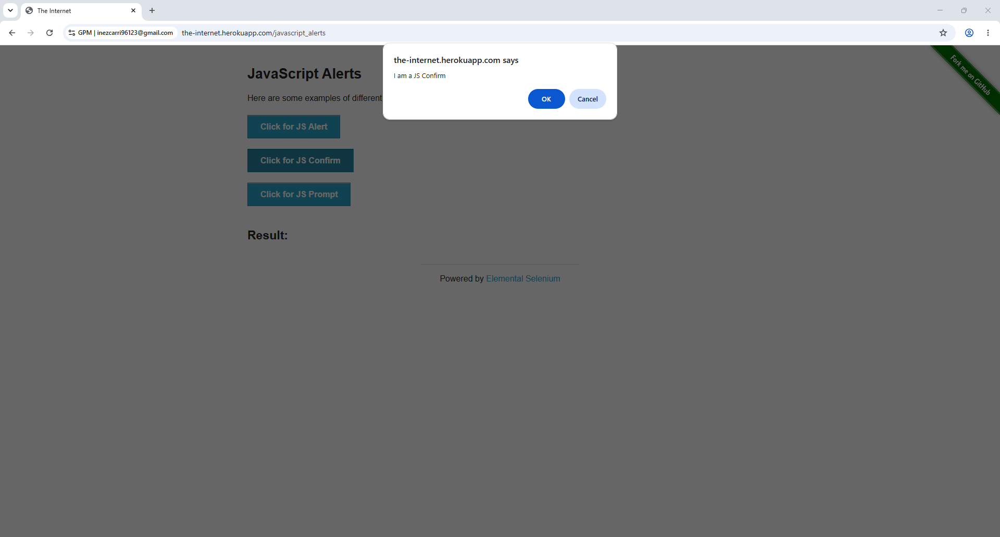

# Accept alert

Accept alert 操作会自动点击原生系统提示对话框(Alert Dialog)上的"确定"或"确认"按钮。此命令不需要配置参数。

🎥 查看更多教程视频:[点击这里](https://youtu.be/3tDWBxDXRfw)。

### ⚠️ 使用注意事项

* 对现代网页界面无效:使用 HTML/CSS 自行设计的对话框(Modal、Dialog UI)并非系统级 Alert。对于这类对话框,您必须使用带有相应 XPath 的 Mouse click。
* 无法处理浏览器弹窗:来自浏览器的安全通知(如摄像头权限、位置权限、HTTP Basic Auth 验证等)无法通过此命令进行交互。请在运行脚本前先在 GPM Login 中直接配置好相关权限。
* 执行机制:
  * 使用 Selenium 时:Automate 会根据指令准确执行 Accept/Cancel 操作。
  * 使用 Puppeteer 时:对话框出现后会立即自动被接受(Accept)。

<figure><figcaption></figcaption></figure>