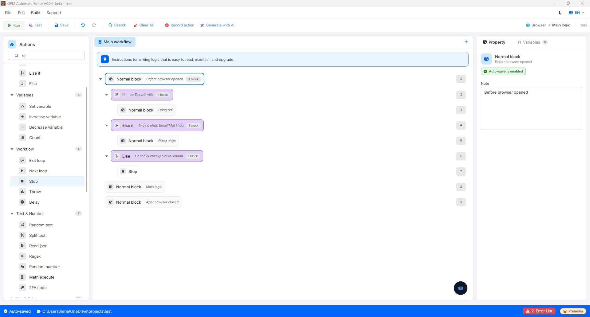

# If, Else if and Else

This is a group of command blocks used to branch the script based on actual conditions at runtime. Instead of running straight from top to bottom, the system will check whether the conditions you set are True or False to decide the next direction for the script. In other words, this group of command blocks acts as the decision-making brain, helping the script automatically handle flexible situations that arise in the browser.

🎥 Watch the tutorial video: [Here](https://youtu.be/ZFS_82u23Cs).

#### 1. Conditional block (If)

If is the command block that checks a specific condition first. If that condition is True, the system will execute all the actions placed inside this If block. If False, the system will skip it and check further down.

#### 2. Additional conditional block (Else if)

Else if always follows the If block (or follows another Else if). This block is activated when all the conditions above it are False. The system will proceed to check its own condition, if True then execute the actions inside, if False then skip again.

> You can add multiple Else if blocks in succession to check various scenarios of the script.

#### 3. Negation block (Else)

Else is the final wrapping command block in the chain of conditions and does not require any conditions to be configured. When all the If and Else if blocks above are False (no case is satisfied), the system will automatically jump in and execute the actions within the Else block.

<figure><figcaption></figcaption></figure>

#### Practical example: Checking the login status of an account

When you open a website (for example: Facebook, X...), the status of the account on the profile may vary. You can use the If - Else if - Else chain to smoothly handle all situations:

* If: See the "Create Post" button (Proving that the account is already logged in).
  * _Action_: Proceed to fill in the content and post it immediately.
* Otherwise if: See the "Username / Password" input box (The account has been logged out).
  * _Action_: Call data from the variable to fill in the account, password, and click Login.
* Otherwise all: Do not see the Post button and also do not see the Login box (The account may have been checkpointed or there is a network error).
  * _Action_: Use the Stop command to halt the program or take a screenshot (Screenshot) for later checking.