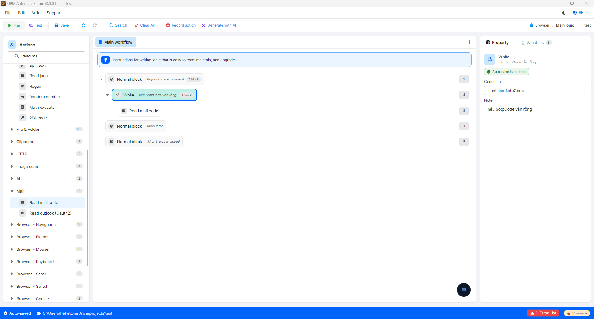

# While

Unlike the For loop (which iterates a fixed number of times), the While loop is typically used when you do not know in advance how many times the scenario will need to repeat, as it completely depends on the actual state at runtime.

🎥 Watch the tutorial video: [Here](https://youtu.be/4O4dPC-CNHM).

#### How it works:

* Before starting each iteration, the system will check the condition that you configured.
* If the condition is not met, the actions inside the While block will continue to be executed.
* As soon as the condition is met, the system will stop the loop and move on to the subsequent actions below the While block.

#### Real-world example: Waiting to get the OTP code from Mail/Telegram

Suppose you are creating a script to register an account and need to wait for the system to send the OTP code to your Email. Since the time it takes for the Mail to arrive can vary, you cannot know in advance how long to wait:

* You place the Read mail code action inside the While block.
* The loop's exit condition: When the variable `$otpCode` receives a value (is no longer empty).
* The system will continuously check and read the mailbox. As soon as it successfully retrieves the OTP code, the condition is met, and the loop stops so the script can proceed to the next step of entering the code.

<figure><figcaption></figcaption></figure>

> ⚠️ Important note: When using the While loop, you need to ensure that the actions inside the command block will change the state of the exit condition. If the condition is configured incorrectly or the Mail never arrives, the script will enter an infinite loop (hanging the script).
>
> To optimize, you should also combine it with a counter variable for the number of checks. If there are more than 10 attempts without receiving Mail, use the Exit loop action to exit the loop, or the Stop action to completely halt the program and move on to the next profile.