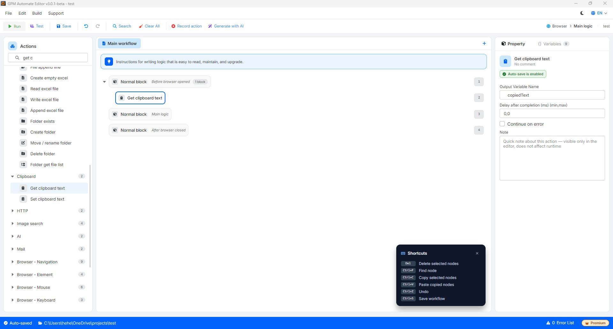

# Get clipboard text

Get clipboard text 是用于读取（获取）计算机剪贴板（Clipboard）中当前存储的全部文本内容的动作——也就是您刚刚从任意来源执行 Copy（`Ctrl + C`）操作的那部分文本——然后将该值保存到一个输出变量中。

当您需要在外部软件（如 Excel、Notepad、其他数据抓取工具）与 GPM 的 Automation 浏览器之间协同处理数据时，此动作非常灵活好用。

#### 配置参数：

* Output variable：用于保存从剪贴板中获取的文本字符串的变量名。

> ⚠️ 对于多线程（Multi-threading）运行的极其重要提示：此动作不适合在多线程模式下运行。Windows 操作系统整台计算机只有唯一一个共享的剪贴板（Clipboard）。如果您同时打开多个 Profile 运行，各个线程会互相争抢并覆盖数据，导致某个线程误取到另一个线程的数据。因此，建议仅在单线程运行（同一时刻只运行 1 个 Profile）时使用此动作。

#### 实际示例：获取外部手动复制的优惠码并填入浏览器

假设您正在以单线程模式运行一个自动下单的脚本。在点击运行流程之前，您浏览网页时发现了一个优惠码，于是用鼠标选中并按下 `Ctrl + C` 复制了字符串 `GIAMGA50K`，将其保存到计算机的内存中。

在 GPM Automate 的流程中，当浏览器导航到结算页面并需要输入优惠码时，您可以按如下方式配置：

* 步骤 1：调用 Get clipboard text 动作，将输出变量命名为 `$copiedText`。
* 步骤 2：调用输入动作（例如 Key press），将变量 `$copiedText` 传入网页上的优惠码输入框中。

结果：系统会自动从 Windows 的剪贴板中取出字符串 `GIAMGA50K`，并直接填入网站中以应用优惠码，帮助您在手动操作与自动化流程之间实现顺畑衔接。

<figure><figcaption></figcaption></figure>