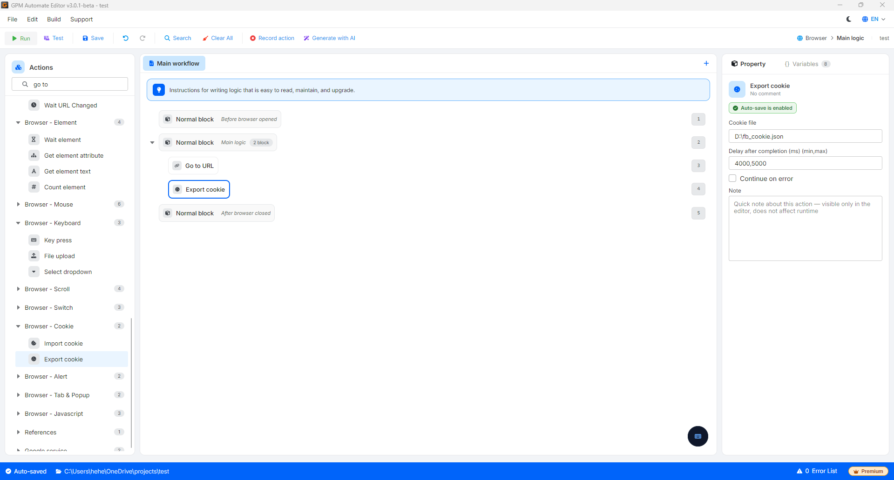

# Export cookie

Export cookie 是提取当前已打开网页的全部 cookie 数据的操作,用于存储、备份或转移到其他系统、设备使用。

#### 配置参数:

* Cookie file:指定导出后生成并写入数据文件的路径(例如:`D:\fb_cookie.json`)。导出的数据将自动打包为标准 JSON 格式。

#### 重要操作注意事项:

* 需要先执行 Go to URL:您还必须先将浏览器导航到需要获取数据的网页,等待网页完全加载完成后,再调用 Export cookie 操作,才能完整获取当前的所有登录会话(session)。

<figure><figcaption></figcaption></figure>

<figure><figcaption></figcaption></figure>