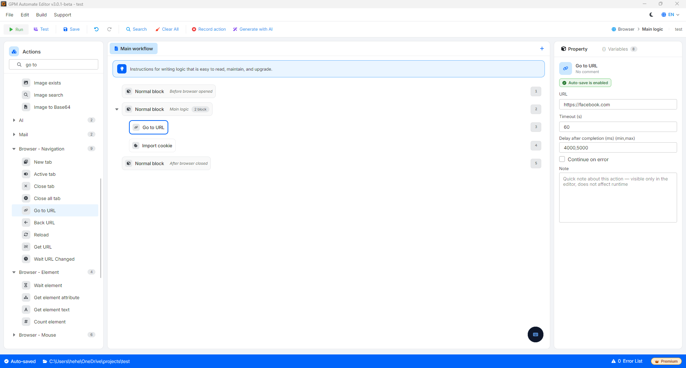
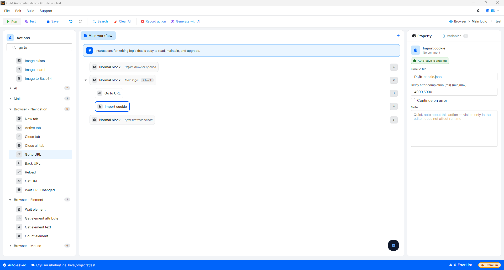

# Import cookie

Import cookie 是将现有的字符串或结构化 cookie 数据文件加载到浏览器中的操作，使账号自动进入登录成功状态，而无需填写用户名/密码。

#### 配置参数：

* Cookie file：指向包含 cookie 结构的 `.json` 文件的绝对路径（或直接传入数据变量）。
* 结构格式：必须是标准的 JSON 格式。

#### 重要操作注意事项：

* 需要先执行 Go to URL：您必须先让浏览器访问正确的目标网站，然后才能调用此操作（例如：先进入 `facebook.com`，然后再 Import cookie Facebook 的 cookie，这样 cookie 才能正确匹配到对应的域名）。
* 仅在当前 session 中有效：加载进去的所有 cookie 数据仅在该次工作会话中临时生效。一旦关闭浏览器 Profile，这部分 cookie 将自动消失，不会覆盖保存到 Profile 的原始数据中。

<figure><figcaption></figcaption></figure>

<figure><figcaption></figcaption></figure>