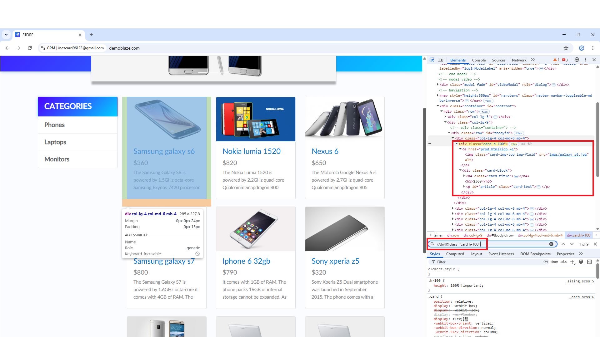
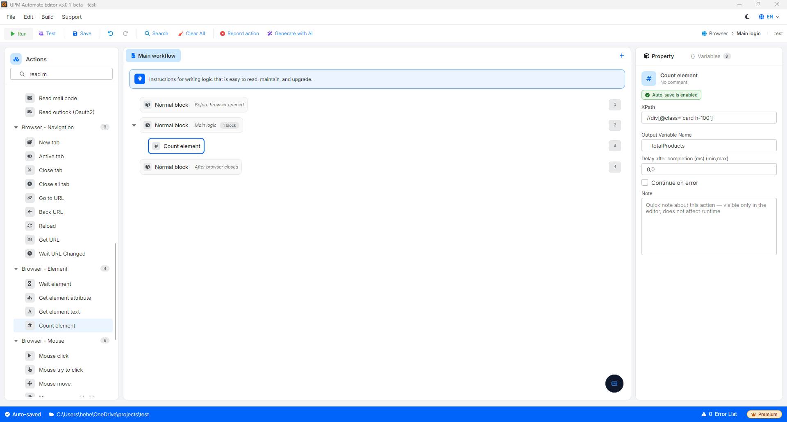

# Count element

此操作可帮助工具在网页上扫描,查看有多少个项目与您提供的"名称"(XPath)相匹配,然后将该总数保存到一个变量中。

* 作用:当您想要检查当前显示的产品数量、统计评论数量,或检查某个列表是否已加载完整数据时,这非常有用。如果统计结果为 0,则表示未找到任何项目;如果统计结果大于 0,则您可以使用循环逐一处理这些项目。

#### 配置参数说明:

* XPath:您想要统计网页界面上元素集合数量的元素标识路径(XPath)。
* Output variable:用于保存统计结果数量的变量名称(返回一个整数:`0`、`1`、`2`、`3`……)。

#### 实际示例:统计商店页面当前显示的产品总数

当您访问如图所示的手机商店页面时,您希望脚本自动检查当前页面正显示多少个产品,以便准确设置交互循环次数或数据抓取次数:

查看源代码结构可以发现,每一个产品单元格都位于一个具有 `class="card h-100"` 属性的 `div` 标签块内。您可以按如下方式配置该操作:

* Element XPath:输入各产品单元格的通用 XPath 路径:`//div[@class="card h-100"]`
* Output variable:将输出变量命名为 `totalProducts`。

结果:系统将扫描整个网页,统计有多少个标签与上述 XPath 相匹配。例如,屏幕上显示 9 个产品,则变量 `$totalProducts` 将获得值 `9`。

> 💡 高级应用:您可以使用此数量变量传入 For 循环的配置中,使脚本自动循环恰好 `9` 次,以点击查看详情或抓取全部 9 个产品的完整信息,既不会多余也不会遗漏。

<figure><figcaption></figcaption></figure>

<figure><figcaption></figcaption></figure>