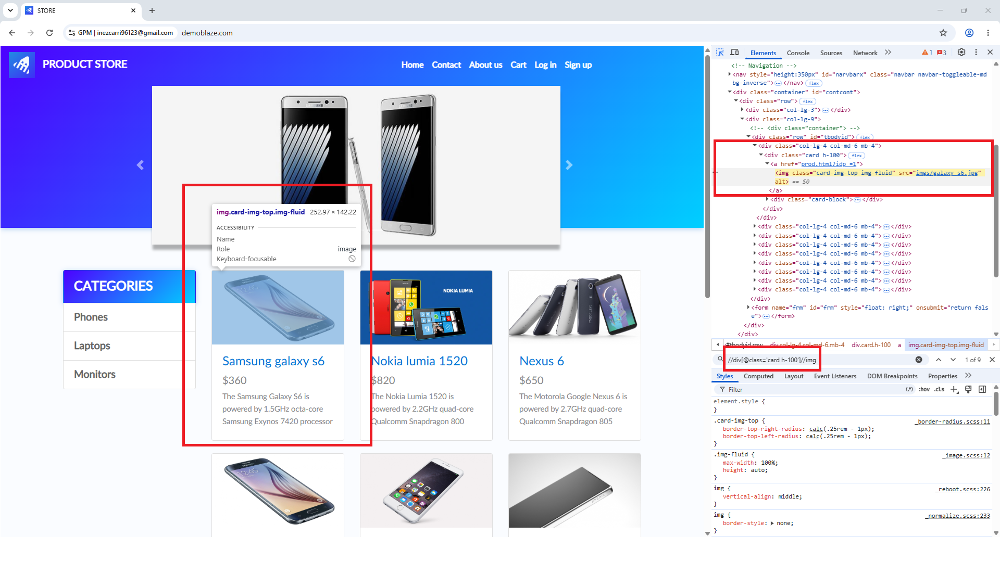

# Get element attribute

此操作可帮助您"提取"网页元素中隐藏的信息，并将其保存到变量中以供后续使用。

* 作用：例如，您可以从 `src` 属性中获取图片路径，或从链接标签的 `href` 属性中获取链接，又或者获取输入框 `value` 中的值。
* 简单理解：网页上的每个元素都带有一些"属性"（就像信息标签一样）。此命令可帮助您读取并"复制"该标签中的信息以保存下来。

#### 配置参数说明：

* Element XPath：包含要获取属性的元素在网页界面上的路径标识（XPath）。
* Attribute name：您想要提取数据的属性名称。
  * _结构示例_：`<标签 属性名称="属性值">文本</标签>` ➔ 您只需在此栏填入 `属性名称` 即可获取 `属性值`。
* Output variable：用于在成功获取后保存属性值字符串的变量名称。

#### 实际案例：根据实际图片抓取产品图片链接（图 5）

根据您在图中操作的手机商店网页界面，您想要抓取（scrape）Samsung Galaxy S6 手机的图片路径，以便存储数据或自动发布到您的商店中。

查看 HTML 源代码表（图右侧红框）：

> 图片标签结构：``

要获取图片路径字符串 `imgs/galaxy_s6.jpg`，您需要如下配置该操作：

* Element XPath：准确输入指向该图片标签的 XPath 路径，例如：`//div[@class="card h-100"]/a/img`（或使用您图中的语法：`//div[@class='card h-100']//img`）。
* Attribute name：填写 `src`_（这是包含图片文件路径的属性名称）_。
* Output variable：将输出变量命名为 `imgUrl`。

结果：系统将查找到 Samsung Galaxy S6 的图片标签，提取 `src` 属性中的值字符串，并将 `imgs/galaxy_s6.jpg` 的值直接载入 `$imgUrl` 变量中。您可以将此变量用于后续的图片下载或存储操作。

<figure><figcaption></figcaption></figure>

<figure><figcaption></figcaption></figure>