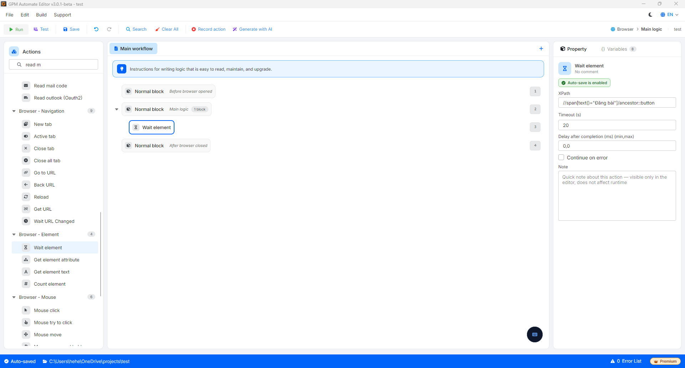

# Wait element

此操作可帮助工具暂停并"等待",直到网页上的某个元素(如按钮、输入框)出现后才继续执行。如果超过等待时间仍未出现,工具会自动跳过。

* 作用:帮助工具与网页的加载速度"同步运行"。相比使用固定等待命令(Delay)浪费时间,此命令可以让脚本以最快的速度运行,同时避免因网页加载缓慢而导致找不到元素的错误。

#### 配置参数:

* Element XPath:您需要在网页界面上等待的元素的路径标识符(XPath)(例如:`//button[@type="submit"]`)。
* Timeout (s):系统等待元素出现的最大限制时间(以秒为单位)。如果超过此时间元素仍未加载出来,脚本将自动转到流程中的下一个操作。

#### 实际案例:上传图片后等待"发帖"按钮准备就绪

当您制作自动发帖(Post 帖子)到社交媒体的脚本时。在您选择图片文件并点击上传后,网页系统需要一段时间来处理并将该图片渲染到服务器上。"发帖"按钮通常会处于灰色(Disabled)状态或尚未出现,直到图片完全上传完成。

* 配置方法:在上传图片操作之后,插入 Wait element 操作。
  * Element XPath:输入发帖按钮的 XPath,例如:`//span[text()="发帖"]/ancestor::button`。
  * Timeout:设置为 `20`(20 秒)。
* 运行逻辑:系统将持续检查网页。如果网络状况良好,图片在 2 秒内上传完成,按钮出现后,脚本将立即执行点击命令进行发帖(节省了 18 秒的无效等待)。如果网络较弱,系统会耐心等待最多 20 秒,以避免流程出现中断错误。

<figure><figcaption></figcaption></figure>