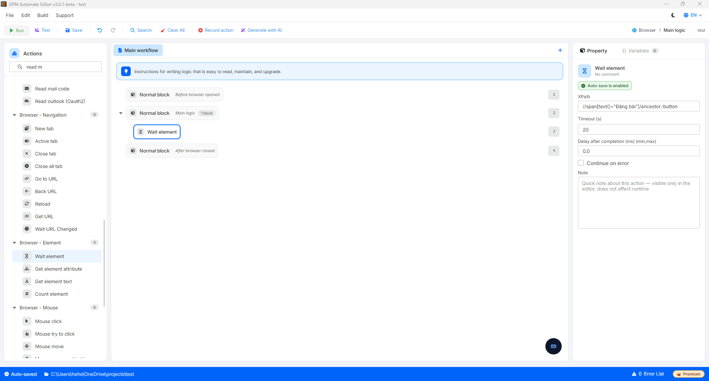

# 等待元素

此操作帮助工具暂停并“监视”，直到网页上的某个元素（如按钮、输入框）出现后再继续工作。如果超出等待时间仍未出现，工具将自动跳过。

* 作用：帮助工具与网页加载速度“协调”运行。与其使用固定等待命令（Delay）浪费时间，不如使用此命令使脚本尽可能快速运行，并避免因网页加载缓慢而导致的找不到元素的错误。

#### 配置参数：

* 元素 XPath：您需要在网页界面上等待的元素的标识路径（XPath）（例如：`//button[@type="submit"]`）。
* 超时（秒）：系统等待元素出现的最大限制时间（以秒为单位）。如果超过此时间元素仍未加载，脚本将自动转到流中的下一个操作。

#### 实际示例：等待“发布”按钮在上传图片后准备好

当您编写自动发布脚本（Post）到社交媒体时。在您选择图片文件并点击上传后，网页系统需要一些时间来处理并将该图像渲染到服务器上。“发布”按钮通常会在图片完全上传之前处于禁用状态（Disabled）或尚未出现。

* 配置方法：在上传图片操作后，插入等待元素操作。
  * 元素 XPath：输入发布按钮的 XPath，例如：`//span[text()="发布"]/ancestor::button`。
  * 超时：设置为 `20`（20秒）。
* 逻辑运行：系统将持续检查网页。如果网络良好且图片在 2 秒内上传完成，按钮出现，脚本将立即运行点击命令以发布（节省了 18 秒的无谓等待）。如果网络较差，系统将耐心等待最长 20 秒以避免流失错误。

<figure><figcaption></figcaption></figure>