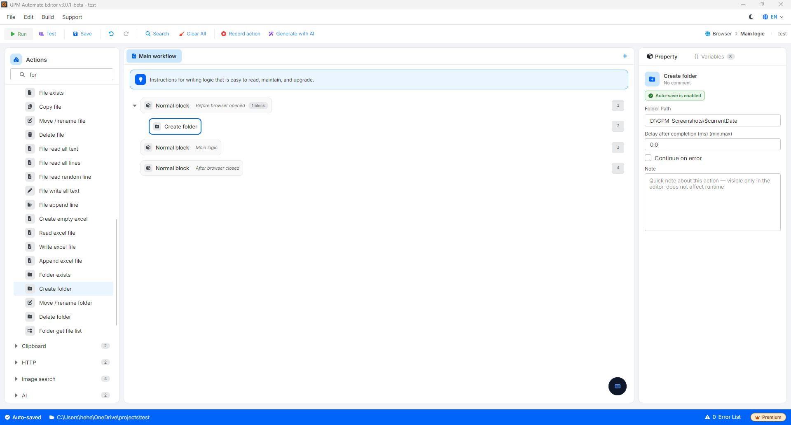

# Create folder

Create folder 是用于按照指定路径在计算机硬盘上全新创建一个文件夹（folder）的操作。

该操作具备智能且安全的运行机制：

* 如果文件夹尚不存在：系统将自动创建该文件夹（包括在父级文件夹不存在时自动创建父级文件夹）。
* 如果文件夹已经存在：系统将跳过并继续执行后续操作，绝对不会覆盖或影响旧文件夹内部的数据。

🎥 查看更多操作指南视频：[点击这里](https://youtu.be/EH7olDLAb9c)。

#### 配置参数：

* Folder Path：您想要创建的文件夹的绝对路径（例如：`D:\GPM_Softwares\Data_Crawler`）。

#### 实际示例：按日期自动创建截图（Screenshot）保存文件夹

在运行养账号或抓取数据的脚本时，您通常需要在遇到错误时截取浏览器画面以便日后查看。为了便于管理，您希望系统每天都能自动将图片归入按日期格式命名的独立文件夹中（例如：`D:\GPM_Screenshots\2026-06-29`）。

* 配置方法：
  * 在调用截图命令之前，先调用 Create folder 操作。
  * Folder Path：将固定路径与系统时间变量结合，填入：`D:\GPM_Screenshots\$currentDate`。
* 结果：当脚本运行到此步骤时，系统会自动检查今天是否已存在以当前日期命名的文件夹（例如：`2026-06-29`）。如果尚未存在，系统会自动创建一个全新的空文件夹。后续的 Screenshot 操作只需将图片保存路径指向该文件夹即可，从而让您的数据始终按每日整齐分类保存。

<figure><figcaption></figcaption></figure>