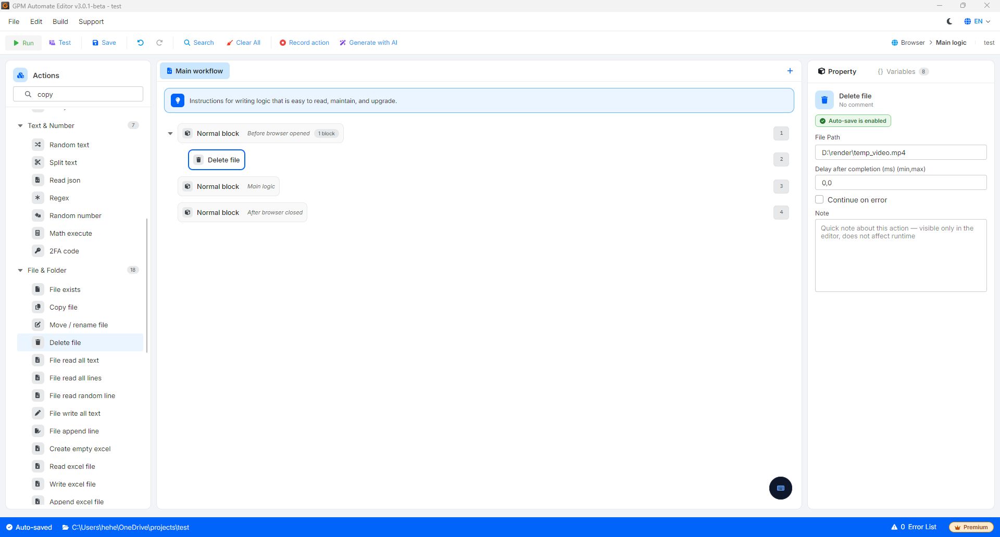

# Delete file

Delete file 是用于根据指定路径将文件从计算机硬盘中完全删除的动作。

🎥 查看更多指导视频：[点击这里](https://youtu.be/EH7olDLAb9c)。

> ⚠️ 重要提示：通过此动作删除的文件将永久消失，不会保存在 Windows 的回收站（Recycle Bin）中。因此，在执行操作之前，您需要确认路径正确，以避免误删重要数据。

#### 配置参数：

* File Path：需要删除的文件在计算机上的绝对路径（例如：`D:\data\temp_cookie.txt`）。

#### 实际示例：脚本结束后自动清理临时文件

当运行诸如从网络下载视频以重新上传到其他频道，或将临时数据导出为文本文件以处理字符串等脚本时。在完成工作后（视频已上传完成、数据已同步到 Google Sheet），您需要删除这些中间文件，以避免占满计算机内存。

* 配置方式：
  * 在脚本末尾，调用 Delete file 动作。
  * File Path：填写已使用的临时文件路径，例如：`D:\render\temp_video.mp4`。
* 结果：系统将彻底删除 D 盘目录下的 `temp_video.mp4` 文件。您的工作目录将始终保持整洁，计算机也不会在自动化流程长期运行数天后出现硬盘空间被占满的情况。

<figure><figcaption></figcaption></figure>