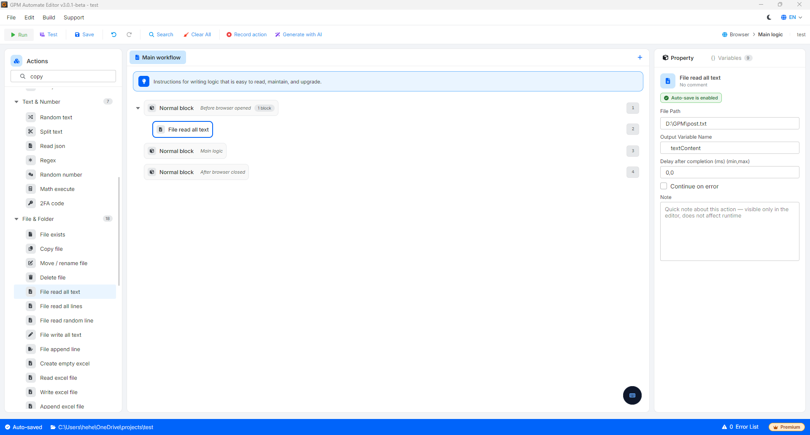

# File read all text

File read all text 是用于一次性完整读取 `.txt` 格式文本文件内容的动作。文件内部的所有数据将以单一字符串（string）形式返回，并保存到输出变量（Output variable）中。

🎥 观看更多教程视频：[点击此处](https://youtu.be/EH7olDLAb9c)。

#### 配置参数：

* File Path：需要读取的 `.txt` 文件的绝对路径（例如：`D:\data\content.txt`）。
* Output variable：用于保存刚读取到的字符串结构的变量名称。

#### 实际示例：读取预先准备好的文章内容

假设你准备了一篇较长的文章（包含多个句子、换行符、空格）保存在文本文件 `D:\GPM\post.txt` 中。你想获取这篇文章的全部内容，以自动填入浏览器上的发帖输入框中：

* 配置方式：
  * File Path：填写路径 `D:\GPM\post.txt`
  * Output variable：将保存结果的变量命名为 `$textContent`。
* 结果：系统将完整提取文件中的所有字符和行结构，并赋值给变量 `$textContent`。在接下来的步骤中，你只需调用 Key press 动作，将该 `$textContent` 变量传入网站的输入框即可完成操作。

<figure><figcaption></figcaption></figure>