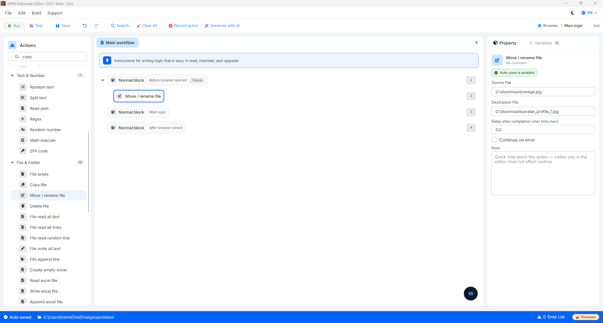

# Move/rename file

Move / rename file 是一个多功能操作,用于将一个文件从当前位置移动到另一个位置,或者在计算机硬盘上的当前位置直接重命名该文件。

与复制(Copy file)不同,此操作会将数据完全剪切到新位置(如果是移动),或完全替换旧名称(如果是重命名)。

🎥 查看更多教程视频:[点击这里](https://youtu.be/EH7olDLAb9c)。

#### 配置参数:

* Source File:需要移动或重命名的源文件的绝对路径(例如:`D:\data\old_name.txt`)。
* Destination File:目标文件的绝对路径,即移动到的位置,或包含重命名后新文件名的路径(例如:`E:\backup\old_name.txt` 或 `D:\data\new_name.txt`)。

#### 实际示例:重命名文件(Rename)

您刚下载了一张图片,想在上传到社交媒体之前将其重命名为有意义的名称,以避免重复。

* Source File:`D:\downloads\image.jpg`
* Destination File:`D:\downloads\avatar_profile_1.jpg`(保留文件夹不变,仅更改末尾的文件名)。
* 结果:文件 `image.jpg` 将消失,并被重命名为 `avatar_profile_1.jpg`。

<figure><figcaption></figcaption></figure>