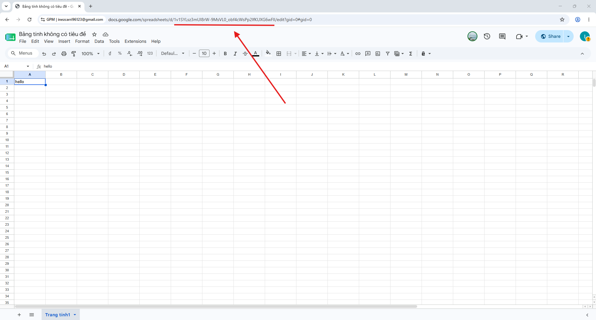
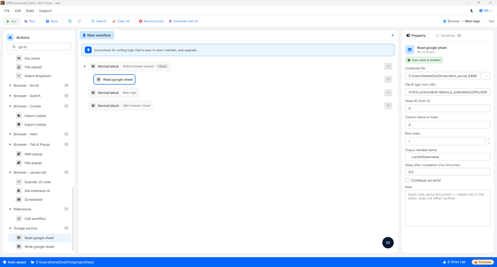

# Read google sheet

Read google sheet 是指令自动化脚本连接到您的 Google Drive 账户，以提取并读取在线 Google Sheets 文件中某个单元格或某个数据区域的内容的操作。

#### 配置参数：

* Credential file：选择 Google 账户身份验证文件（扩展名为 `.json` 的文件）。该文件相当于一把安全密钥，用于与 Google API 系统建立安全连接，验证身份并授权 GPM Automate 能够读取/写入您的 Google Sheet 上的内容。
  * _详细指南_：您可以在这里查看关于如何创建此身份验证文件的视频教程：&#x20;
* File ID：需要交互的 Google Sheets 文件的唯一标识符，以便系统准确识别需要读取数据的文件。
  * _获取 ID 的方法_：当您在浏览器中打开 Google Sheet 文件时，URL 路径将呈现类似 `https://docs.google.com/spreadsheets/d/abc123xyz_ID代码在这里/edit` 的形式。您只需复制位于 `/d/` 和 `/edit` 之间的字符串，并填入此字段。
* Sheet ID：需要读取的工作表（Sheet）在文件内的位置序号（从左边第一个工作表开始计为 `0`，接下来依次为 1、2、3……从左到右）。
* Column Name or Index：指定需要读取数据的列位置。您可以通过 2 种方式输入：
  * _按字母名称_：输入以 `A`、`B`、`C`、`D`……开头的列名。
  * _按序号（Index）_：输入以数字 `1` 开始的序号（对应第 1 列即为 A 列）。
* Row Index：需要读取数据的行的序号，从数字 `1` 开始计算（对应 Google Sheet 上的第 1 行）。
* Output variable：GPM Automate 用于承接并存储从该单元格读取出的文本内容值的变量名称。

#### 实际示例：自动从 Google Sheet 中获取账户数据以填写 Form

当您在一个共用的 Google Sheet 文件中存储了大量的 MMO 账户列表（包括 Username、Password），并希望自动化脚本读取第一行数据以提取出来进行处理时：

* 用于获取 A1 单元格中 Username 的配置方法：
  * Credential file：选择已配置好的 `client_secret_....json` 文件的路径。
  * File ID：输入您的 Sheet 文件 ID 代码。
  * Sheet ID：`0`（读取第一个工作表）。
  * Column Name or Index：填写 `A`（或填写 `1`）。
  * Row Index：填写 `1`。
  * Output variable：`currentUsername`
* 结果：GPM Automate 将在后台连接到 Google Sheet，提取 A1 单元格中的数据，并将文本内容直接载入到变量 `$currentUsername` 中。随后，您可以顺畅地在 Key press 输入操作中调用此变量。

<figure><figcaption></figcaption></figure>

<figure><figcaption></figcaption></figure>