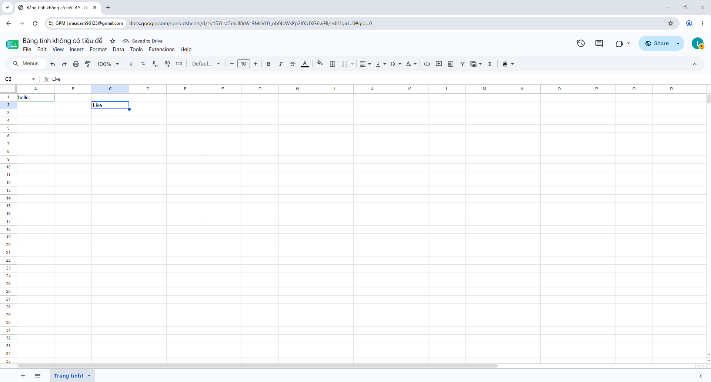
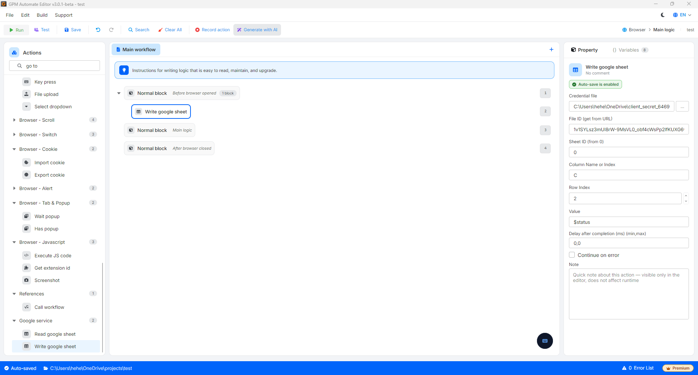

# Write google sheet

Write google sheet 是一个操作,用于指示自动化脚本连接您的 Google Drive 账户,以覆盖或插入新内容到在线 Google Sheets 文件中的特定单元格。

#### 配置参数:

* Credential file: 选择 Google 账户身份验证文件(`.json` 文件)。这是授予 GPM Automate 连接、验证并执行向您的 Google Sheet 写入内容命令的安全凭证。
  * _创建文件指南_: 请在此处查看视频教程:&#x20;
* File ID: 需要交互的 Google Sheets 文件的唯一标识符(从该文件的 URL 路径中位于 `/d/` 和 `/edit` 之间的字符串中获取)。
* Sheet ID: 需要写入内容的工作表的序号(从左到右第一个 sheet 从数字 `0` 开始)。
* Column Name or Index: 指定需要写入数据的列位置。您可以输入字母(例如:`A`、`B`、`C`...)或输入序号 index(例如:`1` 对应 A 列)。
* Row Index: 需要写入数据的行的序号,从数字 `1` 开始计算。
* Value: 您想填入目标单元格的文本内容、数字或来自 GPM Automate 变量的值。

#### 实际示例:运行完成后自动更新账户状态

当您制作养账户或发帖的脚本时,某个 Profile 成功完成任务后,您想在 Google Sheet 的状态列中写入 "Live" 或 "Thành công" 以便方便追踪:

* 写入 C2 单元格的配置方法:
  * Credential file: 选择已配置好的 `client_secret_....json` 文件路径。
  * File ID: 输入您的 Sheet 文件 ID。
  * Sheet ID: `0`(写入第一个 sheet)。
  * Column Name or Index: 填写 `C`(或填写 `3`)。
  * Row Index: 填写 `2`。
  * Value: 填写文字 `Live`(或传入状态变量 `$status`)。
* 结果: GPM Automate 将立即同步并快速将文字 "Live" 直接填入您在线 Google Sheet 上的 C2 单元格,无需打开浏览器中的 Docs。

<figure><figcaption></figcaption></figure>

<figure><figcaption></figcaption></figure>