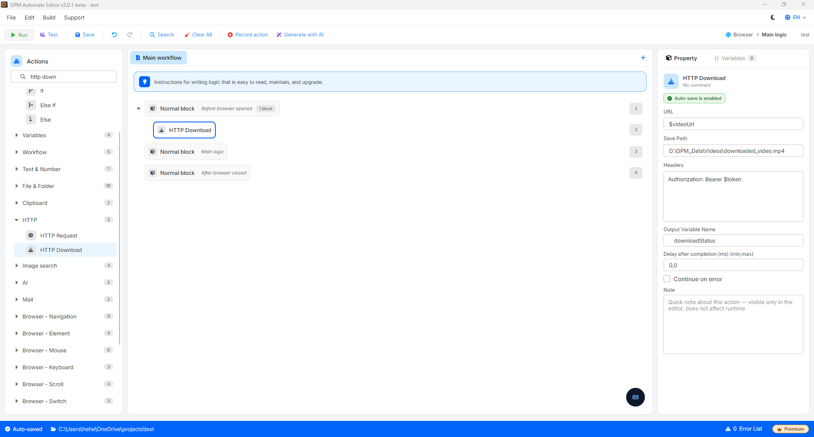

# HTTP Download

HTTP Download 是一个高级动作，用于直接从在线链接（URL）下载文件（如图片、视频、文档文件、zip 文件等）并保存到您的计算机中，而无需打开浏览器手动点击下载按钮。

#### 配置参数：

* URL：直接指向要下载文件的在线链接地址（例如：`https://example.com/images/avatar.jpg`）。
* Save Path：计算机上您想保存下载后文件的绝对路径，包括文件名和文件扩展名（例如：`D:\GPM_Data\downloads\avatar.jpg`）。
* Headers：随请求附带发送的附加信息，用于身份验证访问权限或在服务器要求时模拟浏览器（例如：`User-Agent: Mozilla/5.0...` 或 `Authorization: Bearer $token`）。如果下载的是公开文件，您可以将此项留空。
* Output variable：用于保存动作返回结果的变量名（通常返回逻辑值 `True` 表示文件下载成功，或返回系统的响应日志内容）。

#### 实际示例：自动从现有链接下载视频到计算机

假设您正在运行一个抓取文章的脚本，系统已提取出一个保存在变量 `$videoUrl` 中的在线视频链接。您想将该视频下载到 D 盘上的一个固定文件夹中，以便进行后续处理步骤：

* 配置方式：
  * URL：将变量 `$videoUrl` 传入输入框。
  * Save Path：填写具体的文件保存路径，例如：`D:\GPM_Data\Videos\downloaded_video.mp4`。
  * Headers：留空（如果下载链接是公开的，不需要账号）。
  * Output variable：将保存结果的变量命名为 `downloadStatus`。

结果：系统将自动连接网络，从 `$videoUrl` 路径下载视频文件，并生成一个名为 `downloaded_video.mp4` 的实体文件，整齐地存放在 `D:\GPM_Data\Videos\` 文件夹中。变量 `$downloadStatus` 将获得一个值，您可以使用 If 语句块来检查文件是否已成功下载，然后再进行后续动作。

<figure><figcaption></figcaption></figure>