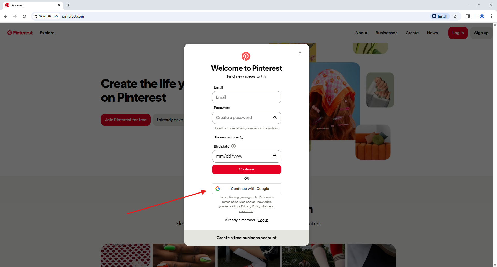
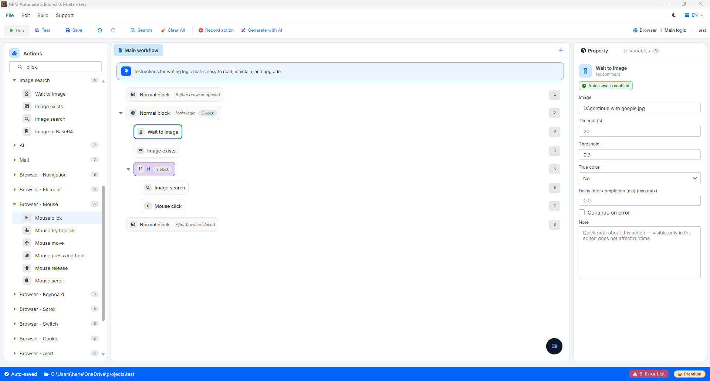
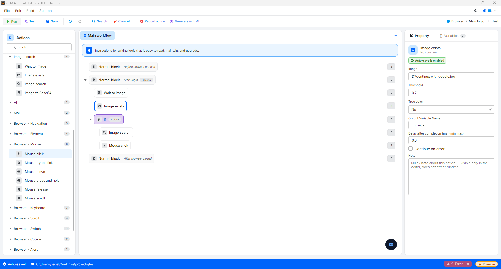
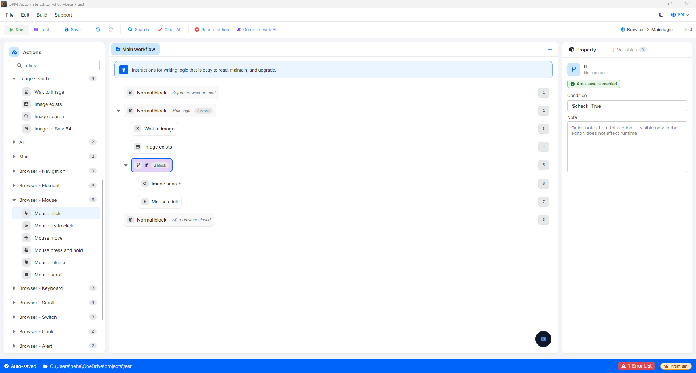
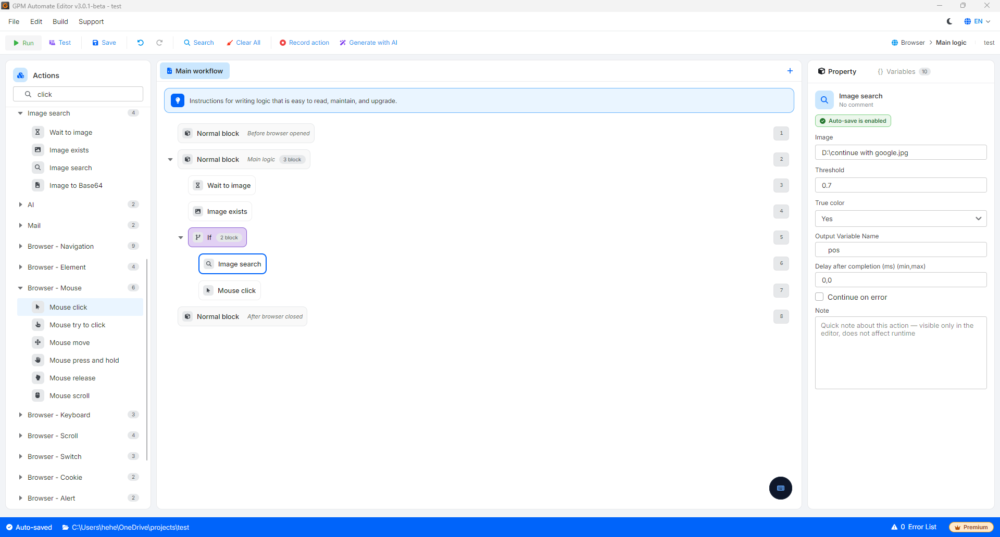
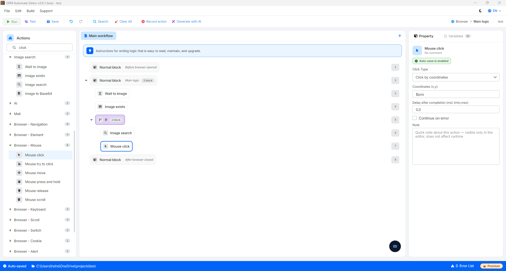

# Image 组合示例

要创建一个智能的自动化脚本,流畅地处理网页或软件界面(UI)上的实际场景,将这三个 action 按照严密的逻辑流程组合起来是最优的解决方案。

以下是关于通用技术参数的详细说明,以及为实际场景设置流程的步骤。

🎥 观看更多教学视频:[点击这里](https://youtu.be/xWu0g35YTGo)。

#### 需要掌握的核心配置参数:

* Image(样本图片):您从屏幕上截取的目标图片区域,作为系统进行比对的数据。
* Timeout(超时时间):系统查找图片的最长等待时间限制(仅适用于 _Wait to image_)。
* Threshold(色差/容差):像素比对的精确比例(通常设置为 `0.7` 到 `0.95`)。数值越接近 `1`,要求实际图片与样本图片越绝对相似。您可以调整这个数值,测试直到合适为止。
* True color:强制系统必须精确比对原始色域的选项。如果关闭,系统会将图片转换为黑白(Grayscale)形式来识别形状,从而提高扫描速度,但会忽略颜色因素。
* Output variable(输出变量):根据所选的 action,用于保存逻辑值(`True`/`False`)或保存坐标点(`X`、`Y`)的变量。

### 实际案例:在 Pinterest 上自动点击"Continue with Google"

<figure><figcaption></figcaption></figure>

**步骤 1:使用 Wait to image 同步页面加载流程**

在您点击 Pinterest 主页上的 _Sign up_ 按钮后,注册表单需要一小段时间才能将数据加载到屏幕上。

* 配置方法:将样本图片(Image)对准标题文字或一个必定会出现在注册表单上的固定元素(Continue with Google 按钮)。将 Timeout 设置为 `10`(10 秒),并设置合适的 Threshold 级别(例如:`0.7`)。
* 运行逻辑:脚本将暂停以观察屏幕。一旦注册表单显示出来,系统立即触发下一步,无需浪费等待时间。

<figure><figcaption></figcaption></figure>

**🔹 步骤 2:使用 Image exists 检查按钮是否存在**

由于 Pinterest 可能会根据不同的 Profile 显示叠加的邮箱输入表单或其他导航提示,我们需要检查 Google 按钮是否确实出现在屏幕上。

* 配置方法:将样本图片对准 Google 的四色字母"G"图标或 Continue with Google 文字。配置输出变量以保存结果。
* 运行逻辑:系统在当时对屏幕进行一次快速扫描。如果 Google 按钮出现,输出变量将获得逻辑值 `True`(反之则为 `False`)。

<figure><figcaption></figcaption></figure>

**🔹 步骤 3:使用 If 代码块筛选处理条件**

为了让脚本运行更加智能,避免出现点击失误的错误,我们将后续的交互步骤包裹在条件代码块中。

* 配置方法:添加 If 代码块并设置条件:检查步骤 2 中的结果变量是否返回 `True` 值(即表示 Google 按钮已在屏幕上准备就绪)。

<figure><figcaption></figcaption></figure>

**🔹 步骤 4:在 If 代码块内使用 Image search 查找精确位置**

位于 If 代码块内部,当条件满足时,系统开始追踪以获取按钮的坐标(因为注册表单的位置可能会根据每个 Profile 的屏幕分辨率灵活变动)。

* 配置方法:使用"Continue with Google"按钮的样本图片或字母"G"的标志。将 True color 设置为 `Yes`_(必须开启,才能准确识别 Google 特有的原始四色,避免与其他文字字符混淆)_。将保存坐标的输出变量设为 `pos`。
* 运行逻辑:系统会扫描并精确计算出屏幕上 Google 按钮中心点的位置(例如:`$pos = 720,540`)。

<figure><figcaption></figcaption></figure>

**🔹 步骤 5:使用 Mouse click 执行点击操作**

这是 If 代码块内完成整个处理流程的最后一步。

* 配置方法:选择 Mouse click action,在坐标设置栏中,直接将上一步获取到的变量传入对应栏位:`$pos`。
* 运行逻辑:系统上的鼠标将自动移动到已扫描到的 Google 按钮的精确像素位置,并执行点击命令,以流畅地穿透 Iframe 层继续登录流程。

<figure><figcaption></figcaption></figure>