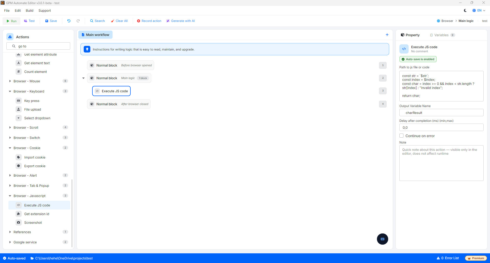

# Execute JS code

Execute JS code 是一个极其强大的操作,它允许您通过在当前网页上直接运行 JavaScript (JS) 代码片段来深度介入浏览器。此操作可帮助您处理复杂的逻辑算法、数学计算、高级数据提取,或执行一些常规 No-code 模块尚未支持的交互操作。

🎥 查看更多视频教程:[点击这里](https://youtu.be/I4-kZ7repv8)。

#### 配置参数:

* Path to js file or code:您可以直接在此框中编写/粘贴 JavaScript 代码,或输入保存在您计算机上的 `.js` 文件的绝对路径。
* Output variable:GPM Automate 的变量名称,用于在 JS 代码运行完成后接收返回值。

#### ⚠️ 在 GPM Automate 中编写 JS 代码时的核心注意事项:

1. 必须包含 `return` 语句:为了让 GPM Automate 系统能够接收到代码处理的结果并将其保存到输出变量中,您必须在 JS 代码末尾添加 `return` 语句。如果没有 `return`,输出变量将获得空值(`undefined`)。如果您的 JS 代码不需要返回任何值,则无需使用 `return` 语句。
2. 此操作**必须**放置在 Main logic 模块内,这类似于您在浏览器的 Dev tools 中运行 js 代码。您可以先在 Dev tools 中测试您的 js 代码,然后再将其用于 Automate 中。
3. 将 Automate 变量嵌入 JS 的规则:您完全可以通过 `$变量名` 语法,将 GPM Automate 中先前保存的变量调用到 JS 代码块中。
   * 对于数字类型的变量(Number):您可以直接编写(例如:`const index = $index;`)。
   * 对于字符串类型的变量(String):您必须用单引号 `'...'`、双引号 `"..."`,或者最标准的反引号 `` `...` `` 将该变量包裹起来,以避免在字符串包含空格或特殊字符时破坏代码格式,例如:``const str = `$postContent`;``。

#### 实际示例:根据指定位置(Index)提取字符

假设在 GPM Automate 脚本中,您已经拥有 2 个变量:

* 变量 `$str` 保存着字符串:`Hello, world!`
* 变量 `$index` 保存着数字:`7`

您想使用 JavaScript 代码从上述字符串中取出位于第 7 个位置的字符(期望结果为字母 `w`),并将其保存到 Automate 的 `$charResult` 变量中。您将按如下方式配置 Execute JS code 操作:

* Output variable:`charResult`
* JS 代码内容:

```
const str = `$str`;
const index = $index;
const char = index >= 0 && index < str.length ? str[index] : "Invalid index";

return char;
```

运行逻辑:系统会将字符串 `Hello, world!` 和数字 `7` 载入代码中,运行算法检查位置的有效性并提取字符。末尾的 `return char;` 语句会将字母 `w` 输出,并直接载入到 `$charResult` 变量中,供您用于后续操作。

<figure><figcaption></figcaption></figure>