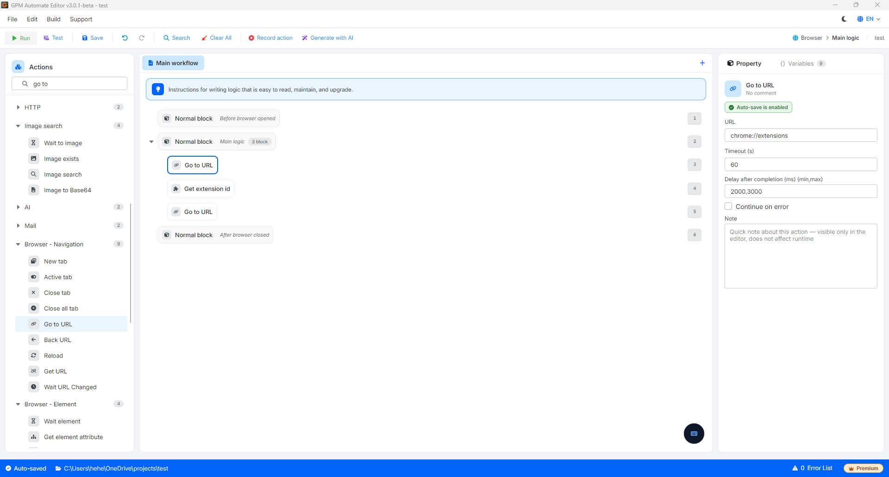
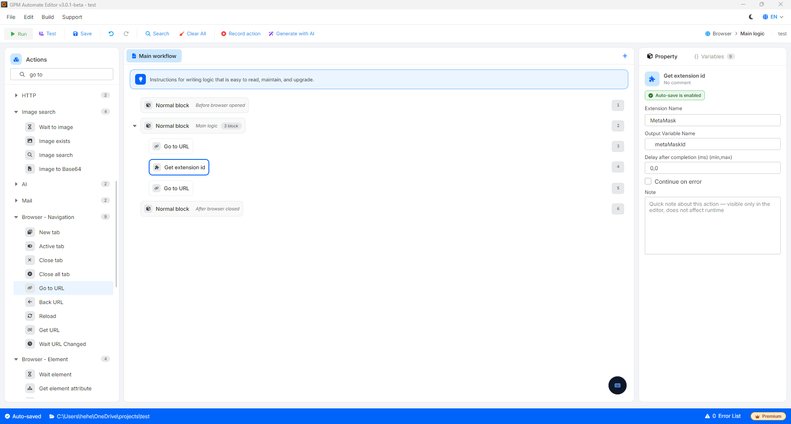
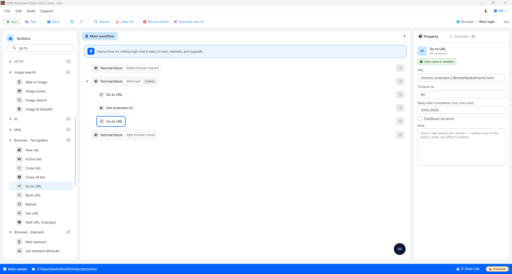

# Get extension id

Get extension id is an action that commands the browser to extract the unique identifier (Extension ID) of the extensions installed within the current browser Profile. This ID is extremely important for you to use in subsequent commands such as navigating directly to the configuration page or wallet of that extension (for example: quickly opening MetaMask, Tonkeeper, OKX Wallet...).

🎥 Watch the tutorial video: [Here](https://youtu.be/I4-kZ7repv8).

#### Configuration parameters:

* Extension name: The name of the extension displayed in the browser from which you want to get the ID.
  * _Note_: The system applies a relative search mechanism, you do not need to enter the entire name accurately but just include a distinctive phrase (For example: just enter `MetaMask` or `OKX` instead of typing the full lengthy name).
* Output variable: The variable name to store the ID string after extraction (For example: store in variable `extId`).

#### ⚠️ Mandatory operational note for successful ID retrieval:

Due to the security mechanism and internal data flow management of the Chromium browser engine, if you are on a regular webpage and call this command immediately, the system will not be able to scan the list of extensions. To ensure this action works 100% accurately, you need to follow the process below:

* Must access the management page first: Your script must use the Go to URL action to access the internal browser address `chrome://extensions/` first.
* Must have a wait time (Delay): After redirecting to the extension management page, you must insert a short Delay command (about 1 - 2 seconds). This delay allows the browser's management interface to fully load the source code structure of the extensions, preventing the script from running too quickly and failing to capture the ID.

#### Practical example: Workflow to get extension ID to automatically open the wallet

When you create an automation script for Crypto/Airdrop tasks, you want to get the ID of the MetaMask wallet for quick access to the wallet unlock page:

* Step 1: Use the Go to URL action ➔ Enter the URL: `chrome://extensions/`.
* Step 2: Drag the Delay action ➔ Enter the wait time: `2000` (equivalent to 2 seconds).
* Step 3: Drag the Get extension id action:
  * _Extension name_: `MetaMask` (just needs to contain this keyword).
  * _Output variable_: `metaMaskId`.
* Step 4: After having the ID stored in the variable `$metaMaskId`, you can use the next Go to URL action with the structure: `chrome-extension://$metaMaskId/home.html` to immediately open the wallet interface for processing without needing to manually search on the toolbar.

<figure><figcaption></figcaption></figure>

<figure><figcaption></figcaption></figure>

<figure><figcaption></figcaption></figure>