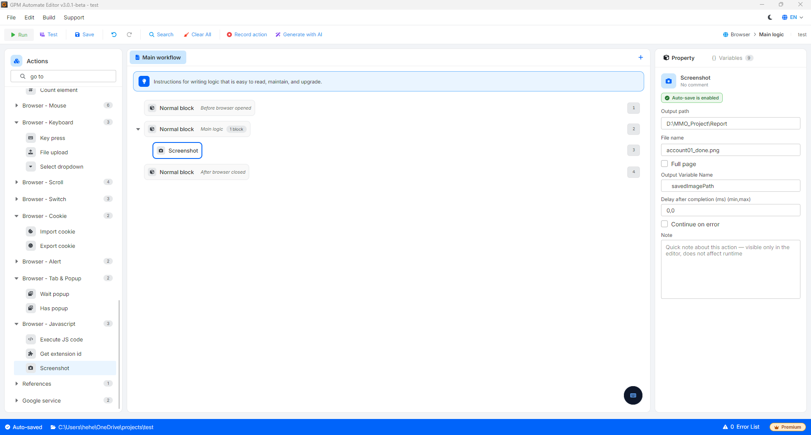

# Screenshot

Screenshot is an action that commands the browser to automatically capture the interface of the current webpage. This action is very useful for storing evidence of completed tasks, capturing QR Codes, or saving error interfaces when a script encounters issues for easier debugging.

🎥 Watch the tutorial video: [Here](https://youtu.be/c3gYFS7IIr4).

#### Configuration parameters:

* Output path: The absolute path to the folder on your computer where you want to store the image after capturing (e.g., `D:\GPM_Automate\Screenshots`).
* File name: The name of the image file you want to set (e.g., `success_evidence.png`). You can pass dynamic variables such as account numbers or timestamps here to avoid overwriting previous files.
* Full page: Check this option if you want the system to capture the entire webpage from top to bottom. If unchecked, the system will only capture the current viewport (the area currently visible).
* Output variable: The variable name in GPM Automate used to store the absolute path of the image file created after a successful capture.

#### Practical example: Automatically save confirmation image after successfully posting

When you script an automatic sales post or service to increase interaction. After the system displays the message "Post successful," you want to take a screenshot for reporting to the client:

* Configuration:
  * Output path: `D:\MMO_Project\Report`
  * File name: `account01_done.png`
  * Full page: _Checked_ (to capture the entire content of the post that extends below).
  * Output variable: `savedImagePath`
* Result: GPM Automate will capture the entire webpage, package it into an image file saved in the specified folder, and store the file path in the variable `$savedImagePath` for you to use in subsequent actions to send reports via Telegram/Discord. 

<figure><figcaption></figcaption></figure>