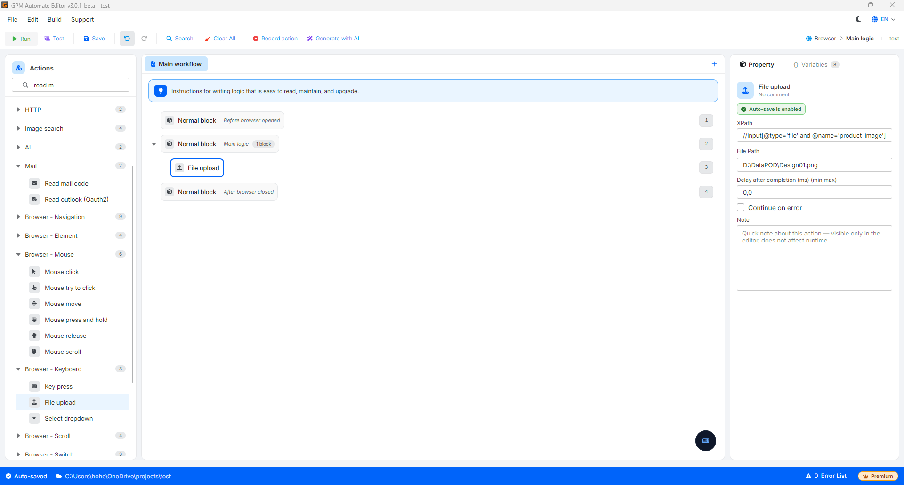

# File upload

File upload is the action that instructs the browser to automatically push one or more files (images, videos, Excel documents, txt...) from your computer to the server of the target website.

🎥 Watch the tutorial video: [Here](https://youtu.be/cCTEtuMtz-s).

#### Configuration parameters:

*   XPath: The identifier path (XPath) that leads directly to the file upload frame of the website.

    > ⚠️ Important note: When automating with code, do not click directly on buttons labeled "Choose Image" or "Upload Image" (as it will open the file selection window of the Windows/macOS operating system, freezing the script). Instead, you must find the correct hidden tag structured as: `//input[@type='file']` on the website to fill in the XPath in this field.
* File path: The absolute path leading to the file stored on your computer (e.g., `C:\Users\Admin\Desktop\avatar.png`). You can pass a variable containing the dynamic path here (e.g., `$filePath`).

#### Practical example: Upload product image to the system

When you script the posting of sales listings automatically to e-commerce platforms or social networks, the standard processing flow will be as follows:

* Configuration:
  * Element XPath: `//input[@type='file' and @name='product_image']` (Scan the page source to find this hidden input tag).
  * File path: `D:\DataPOD\Design01.png`
* Operational logic: GPM Automate will directly pass the file path `D:\DataPOD\Design01.png` into the `input` element of the website. The website's system will immediately recognize it and start the image upload process smoothly without displaying the Open File dialog of the operating system.

<figure><figcaption></figcaption></figure>