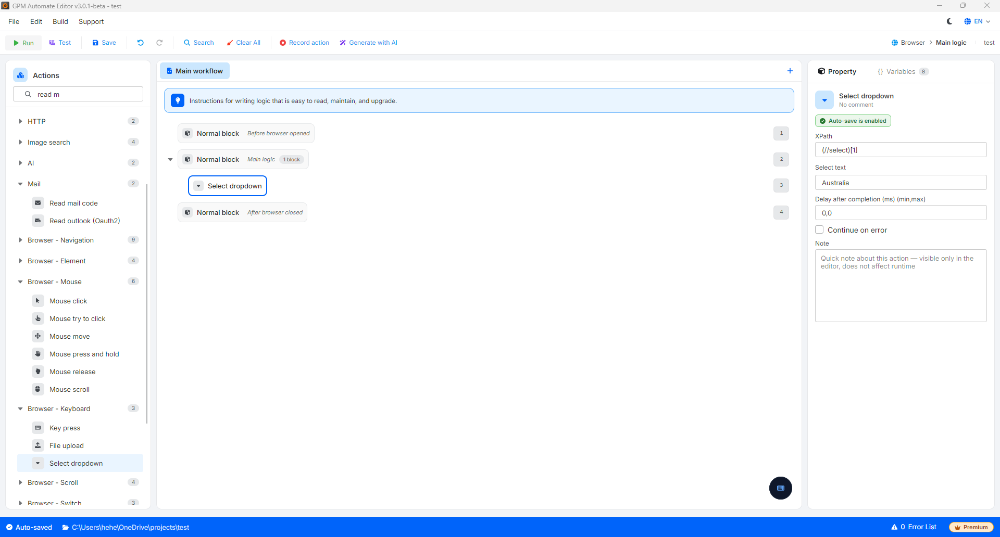
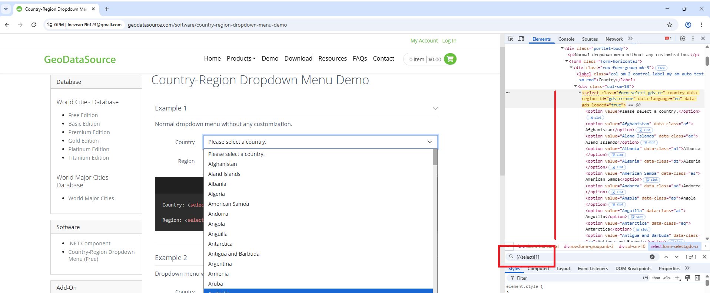

# Select dropdown

Select dropdown 是一个操作指令，用于命令浏览器自动在下拉菜单列表中选择一个特定的值。

🎥 查看更多指导视频：[点击这里](https://youtu.be/cCTEtuMtz-s)。

> ⚠️ 重要提示：此操作仅对标准 HTML 结构为 `<select>` 的标签有效（例如：选择省/市、传统出生年份等菜单）。
>
> 对于由 `
` 或 `` 标签自定义构建的新一代下拉框（如某些现代社交网络的界面），此操作将不起作用。在这种情况下，您需要通过以下方式处理：使用 Mouse click 命令点击下拉框使列表展开 ➔ 再使用第二个 Mouse click 命令，根据该行的 XPath 点击需要选择的值。

#### 配置参数：

* XPath：直接指向网页上 `<select>` 标签的识别代码路径（XPath）（例如：`(//select)[1]`。
* Select text：根据屏幕上公开显示的文字内容填写（例如：`<option value="VN">Việt Nam</option>` ➔ 填写值为 `Việt Nam`）。

#### 实际示例：注册账户时自动选择国家

当您的脚本运行到注册账户信息的步骤，并遇到一个选择国家的菜单框时。

* 配置方法：
  * XPath：`(//select)[1]`
  * Select text：填写 Australia
* 结果：系统将立即激活选择框，并准确、安全地将屏幕上显示的值切换为"Australia"。

<figure><figcaption></figcaption></figure>

<figure><figcaption></figcaption></figure>