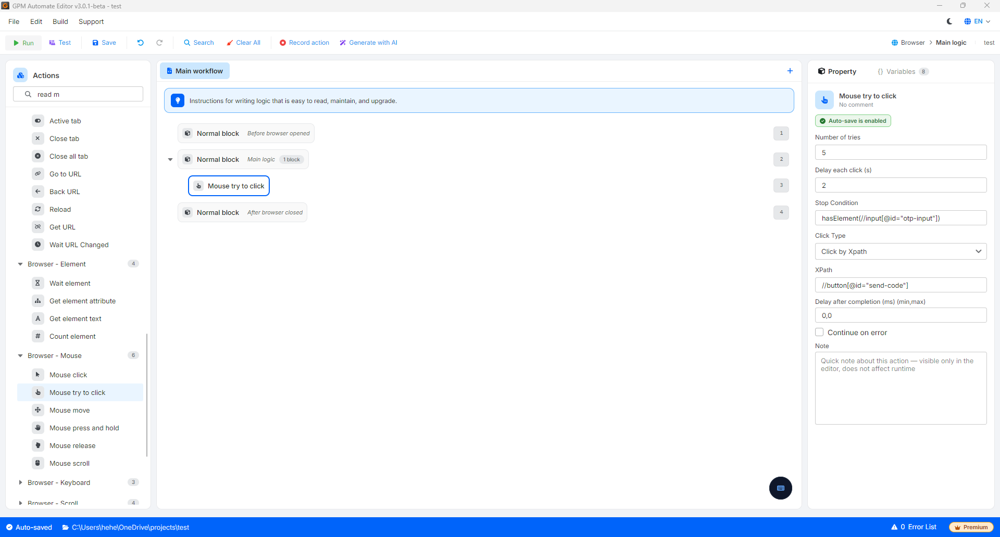

# Mouse try to click

Mouse try to click 是鼠标指令组中的高级操作，允许脚本对某个目标重复执行多次点击操作，直到满足预期条件才停止。

此操作是处理网站上"顽固"按钮（这类按钮有时会出现卡顿，需要连续点击几次才能生效）的完美解决方案，或用于抢（刷）领取奖励的按钮、短时间内出现的开宝箱按钮。

🎥 查看更多操作指南视频：[点击这里](https://youtu.be/kQZWs1I76Zo)。

#### 核心配置参数：

* Click type：与 Mouse click 操作类似，您也有 3 种选择方式来指定点击鼠标的位置：
  1. _根据 XPath 点击_：系统查找元素的 HTML 标签进行点击。
  2. _根据鼠标指针当前位置点击_：在鼠标指针静止不动的位置连续点击。
  3. _根据坐标点击_：点击固定像素点，或传入组合坐标形式的变量，如 `900,800`（结合 _Image search_ 操作的结果）。
* Number of tries：脚本允许执行的最大尝试点击次数（例如输入 `10`，系统将最多点击 10 次后自动停止该流程，转到下一个操作，避免脚本无限卡住）。
* Delay each clicks (s)：两次连续点击之间的间隔时间，以秒计（例如输入 `0.5` 或 `1` 秒，以避免点击过快而被系统误判为垂直/DDoS 攻击）。
* Stop condition：使系统立即下达停止点击指令的条件。鼠标将持续点击，直到该条件被满足，或者已经点击了 _Number of tries_ 中规定的次数为止。

#### 实际示例：连续点击"获取 OTP 验证码"按钮，直到验证码输入框出现为止

当您在加载缓慢的网站上进行账户注册时，点击"发送验证码"（Send Code）按钮后，系统可能会出现卡顿，无法立即响应。此时您需要让鼠标持续点击，直到屏幕上出现一个 OTP 验证码输入框才能停止。

* 配置方式：
  * Click type：选择 _根据 XPath 点击_ ➔ 输入发送验证码按钮的 XPath：`//button[@id="send-code"]`。
  * Number of tries：输入 `5`（最多尝试 5 次）。
  * Delay each clicks：输入 `2`（每次点击间隔 2 秒，以等待网页处理）。
  * Stop condition：使用检查元素是否出现的函数：`hasElement(//input[@id="otp-input"])`。

运行逻辑：系统将鼠标移到发送验证码按钮并进行第 1 次点击。2 秒后，系统检查 OTP 验证码输入框（`//input[@id="otp-input"]`）是否已经出现。如果还没有出现，系统继续进行第 2 次、第 3 次点击……当点击到第 3 次时，系统响应并使 OTP 验证码输入框显示在屏幕上（`hasElement` 函数返回真值），脚本将立即停止此点击操作，并转到下一步，而不需要再执行剩余的 2 次点击。

> 💡 扩展技巧：您也可以使用否定条件 `!hasElement(XPATH)`，让鼠标持续点击，直到某个广告横幅或页面加载中的旋转图标（loading）从屏幕上消失为止。

<figure><figcaption></figcaption></figure>