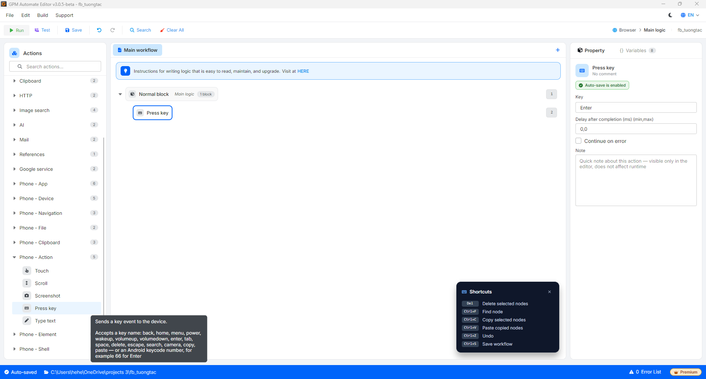

# 按下按键

按下按键是向手机设备发送一个按键事件，例如按下 Enter 进行搜索，调高/调低音量，打开相机...

#### 配置参数说明：

* Key: 需要发送的按键名称或 Android 的 keycode。接受的按键名称有：`back`、`home`、`menu`、`power`、`wakeup`、`volumeup`、`volumedown`、`enter`、`tab`、`space`、`delete`、`escape`、`search`、`camera`、`copy`、`paste` — 或直接输入 Android 的 keycode 数字，例如 `66` 对应 Enter 键。

<figure><figcaption></figcaption></figure>