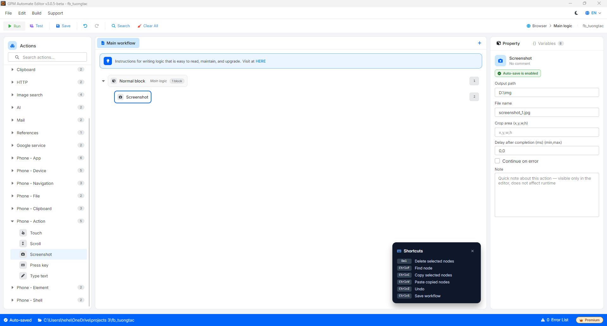

# Screenshot

Screenshot 是捕捉手机设备屏幕并将图像文件保存到计算机的操作。

#### 配置参数说明：

* Output path: 保存图像的计算机目录，例如 `D:\img`。
* File name: 图像文件名，例如 `screenshot_1.jpg`。
* Crop area (x,y,w,h): （可选）根据 `x,y,w,h` 裁剪图像区域 — 左上角坐标 (x,y) 以及宽度 (w) 和高度 (h)。如果想要捕捉整个屏幕，请留空。

<figure><figcaption></figcaption></figure>