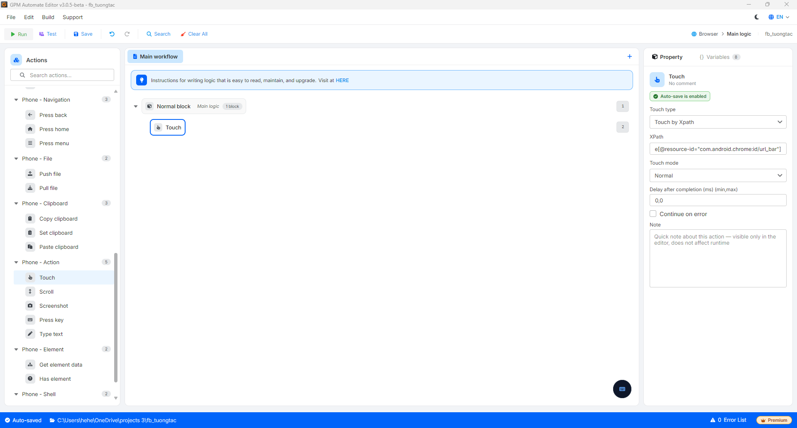

# Touch

Touch 是在手机设备屏幕上进行触摸的动作。可以根据元素的 XPath 或坐标来确定触摸点。

#### 配置参数说明：

* Touch type: 选择确定触摸点的方式，例如 `Touch by Xpath`（通过 XPath 触摸元素）。
* XPath: 使用 Touch by Xpath 类型时需要触摸的元素的 XPath，例如 `//node[@resource-id="com.android.chrome:id/url_bar"]`。查看获取 XPath 的方法请参见 [Hướng dẫn xác định XPath & toạ độ](./xpath-and-coordinates-guide.md)。
* Touch mode: 触摸类型，例如 `Normal`（普通触摸一次）。

<figure><figcaption></figcaption></figure>