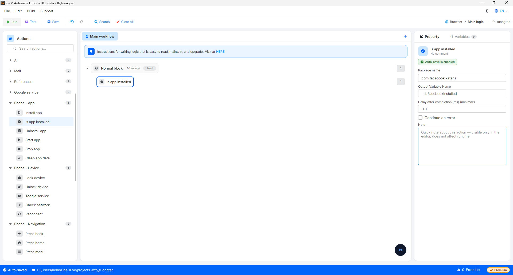

# Is app installed

Is app installed 是一个检查应用程序（按包名）是否已安装在手机设备上的操作，然后将结果返回给一个变量以分支脚本（例如：未安装则安装，已安装则打开）。

#### 配置参数说明：

* Package name: 需要检查的应用程序的包名，例如 Facebook 是 `com.facebook.katana`。
* Output Variable Name: 存储返回结果的变量名称，返回布尔值（如果应用程序已安装则为 `true`，如果未安装则为 `false`）。在 If 块中使用此变量以决定下一步。

<figure><figcaption></figcaption></figure>