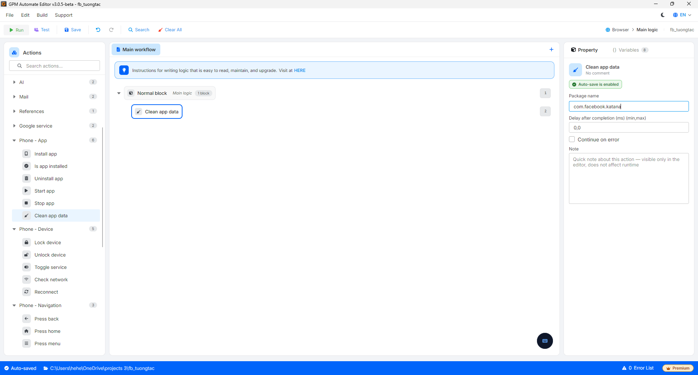

# Clean app data

Clean app data is the action of deleting all data and cache of an application, restoring the app to a clean state as if it were just installed (logging out of the account, losing all settings). It is useful when needing to run the app again with a new account.

#### Explanation of configuration parameters:

* Package name: The package name of the application whose data needs to be deleted, for example `com.facebook.katana`.

<figure><figcaption></figcaption></figure>