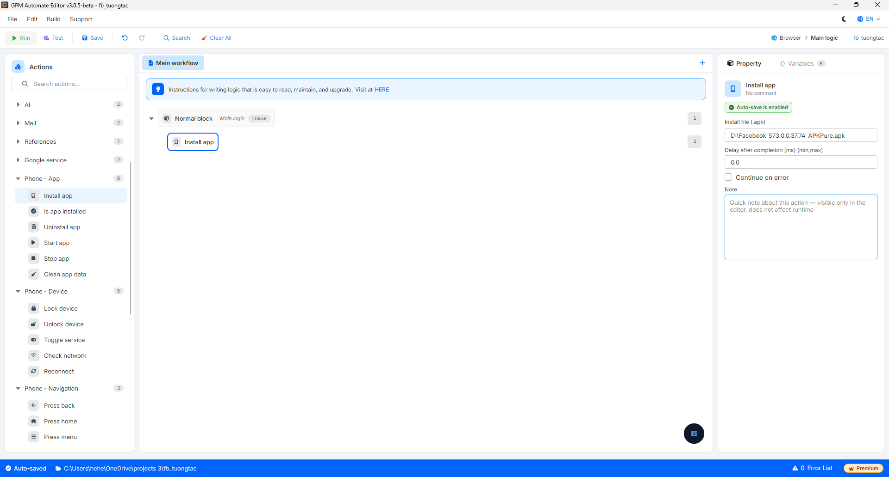

# Install app

Install app is the action of pushing and installing an Android application file (in `.apk` format) from the computer to the connected mobile device. It is often used at the beginning of a script to prepare the application needed for manipulation (for example, installing Facebook, TikTok...) before opening it to run.

#### Explanation of configuration parameters:

* Install file (.apk): The path to the `.apk` file on the computer that needs to be installed on the device (for example: `D:\Facebook_573.0.0.37.74_APKPure.apk`). You can directly enter the path or pass in a variable containing the file path.

<figure><figcaption></figcaption></figure>