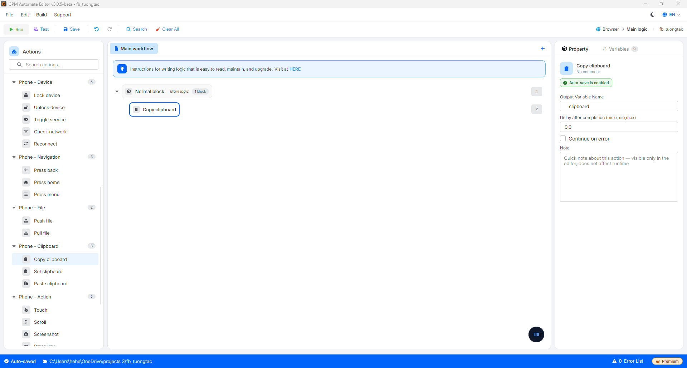

# Copy clipboard

Copy clipboard is the action of retrieving the content currently in the clipboard of the device and saving it to a variable for use in subsequent steps.

#### Explanation of configuration parameters:

* Output Variable Name: The name of the variable that stores the clipboard content read from the device.

<figure><figcaption></figcaption></figure>