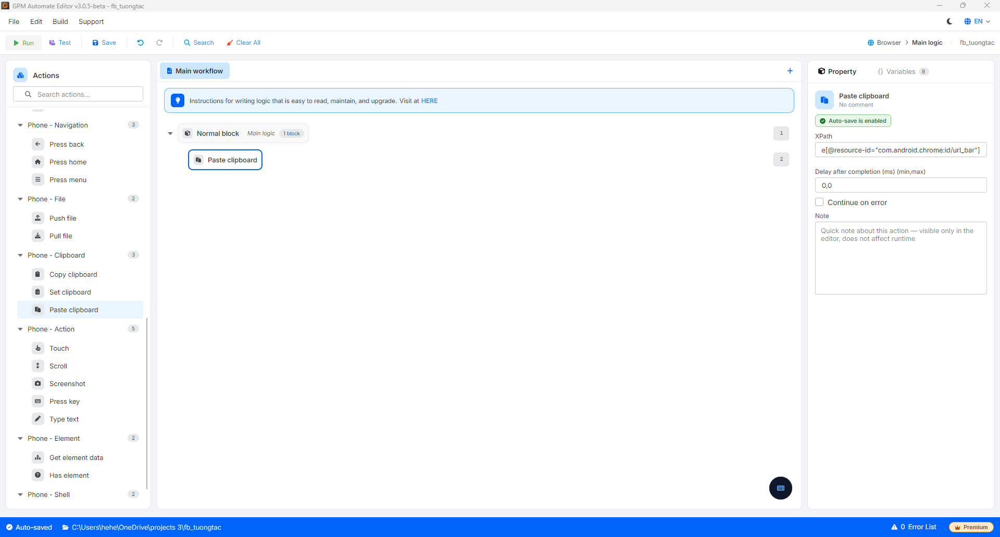

# 粘贴剪贴板

粘贴剪贴板是将设备剪贴板中当前内容粘贴到通过XPath确定的元素（输入框）中的操作。

#### 配置参数说明：

* XPath：需要粘贴内容的元素的XPath，例如 `//node[@resource-id="com.android.chrome:id/url_bar"]`。查看获取XPath的方法请参见 [确定XPath和坐标指南](../phone-action/xpath-and-coordinates-guide.md)。

<figure><figcaption></figcaption></figure>