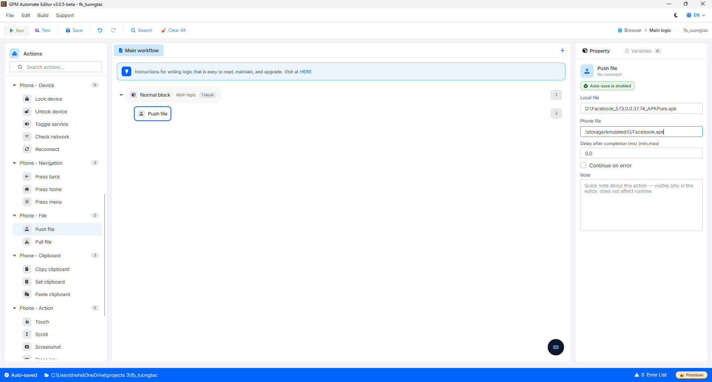

# Push file

Push file is the action of copying any file from the computer to the memory of the mobile device (for example, pushing an APK file to the device before installation, or pushing images/videos for posting).

#### Explanation of configuration parameters:

* Local file: The source file path on the computer, for example `D:\Facebook_573.0.0.37.74_APKPure.apk`.
* Phone file: The destination path on the device where the file will be stored, for example `/storage/emulated/0/Facebook.apk`.

<figure><figcaption></figcaption></figure>