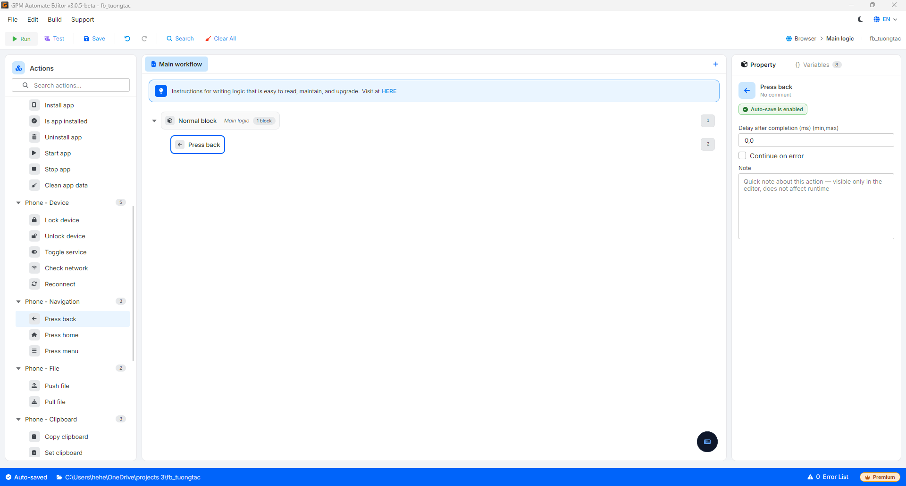

# Press back

Press back is the action of pressing the Back button on Android, equivalent to the action of pressing the back button to return to the previous screen. This action does not require configuration parameters.

<figure><figcaption></figcaption></figure>