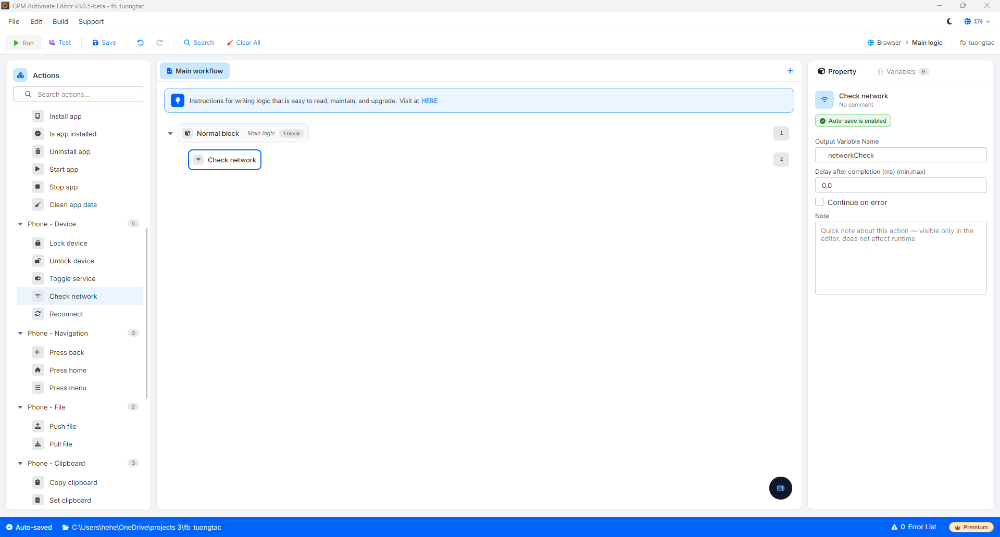

# Check network

Check network 是检查设备是否连接到互联网的操作，通过 ping Google 服务器来实现。结果被保存到一个变量中，以便在脚本中进行分支（例如：如果断网，则调用 Reconnect 或重新启用 Wi-Fi）。

#### 参数配置说明：

* Output Variable Name: 保存连接检查结果的变量名称（有网络 / 没有网络）。在 If 块中使用此变量进行相应处理。

<figure><figcaption></figcaption></figure>