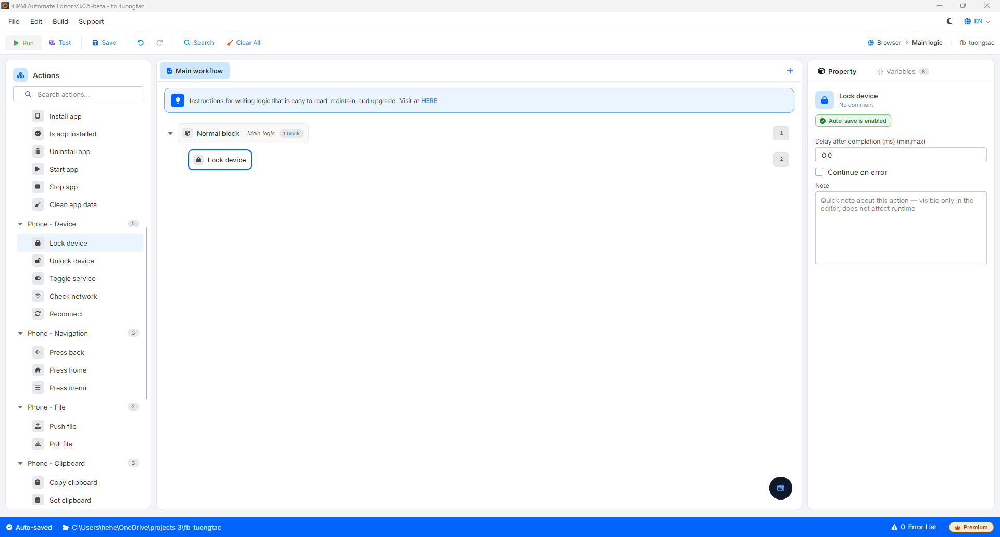

# Lock device

Lock device is the action of locking the screen of a mobile device (turning the screen off to the locked state), equivalent to pressing the power button. This action does not require configuration parameters.

<figure><figcaption></figcaption></figure>