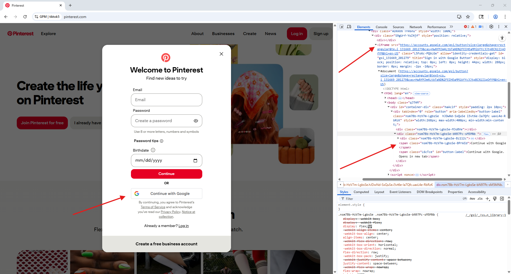
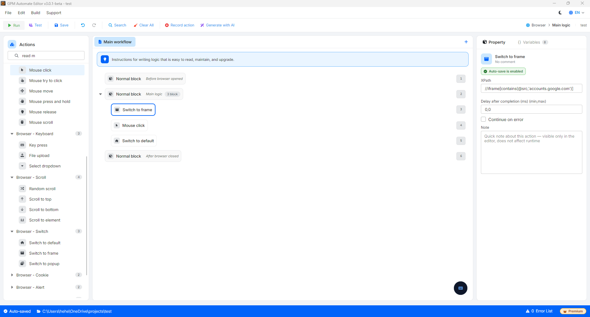
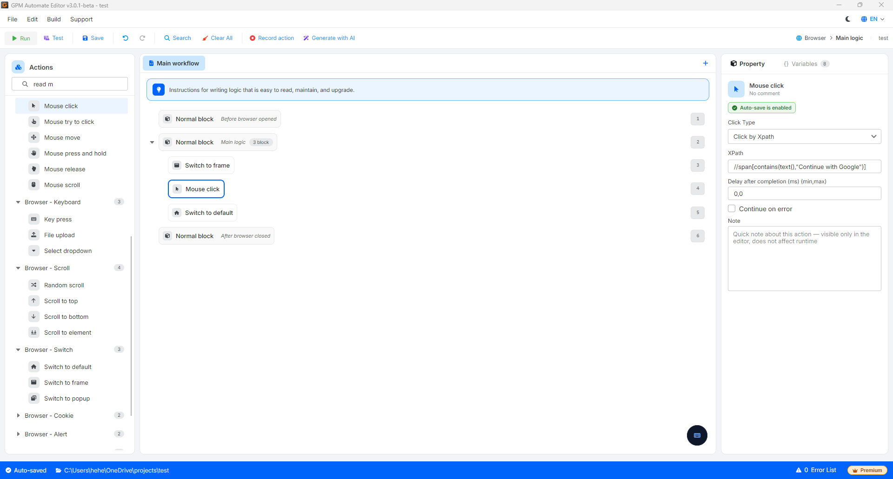

# Switch to frame

In the structure of web design, an Iframe (Inline Frame) is understood as an independent browser window embedded within another webpage.

When an element (such as a button, input field) is inside an `<iframe>` tag, the GPM Automate system will not be able to find its XPath if you are still in the main webpage space. You must use the action Switch to frame to "enter" that Iframe in order to interact with it. After finishing the interaction, you must use Switch to default to "exit" back to the main interface.

🎥 Watch the tutorial video: [Here](https://youtu.be/oroexOGjZfw).

#### 1. Action to switch into Iframe (Switch to frame)

* Purpose: Transfer control of the script into a specified Iframe window.
* Configuration parameters:
  * XPath: The XPath path directly to the target `<iframe>` tag on the webpage.

#### 2. Action to return to the main interface (Switch to default)

* Purpose: Transfer control out of the current Iframe to return to the original structure of the webpage. This action has no configuration parameters.

#### Practical example: Click the "Continue with Google" button on Pinterest (Attached images)

Based on the image below, the Continue with Google button is not actually located directly on the Pinterest page, but is contained within a secure Iframe window embedded by Google (The red arrow at the top right of the source code points directly to the `<iframe src="https://accounts.google.com...">` tag).

If you only use the _Mouse click_ command directly on the _Continue with Google_ button (`//span[text()="Continue with Google"]`), the script will immediately report an element not found error. The standard processing procedure must be configured as follows:

* Step 1 (Enter Iframe): Drag the Switch to frame action into the script.
  * _XPath_: Enter the XPath of the iframe tag as you found: `//iframe[contains(@src,'accounts.google.com')]`
* Step 2 (Click the button): Drag the Mouse click action into the flow.
  * _Click type_: Click based on XPath.
  * _XPath_: Enter the XPath of the button inside the iframe: `//span[contains(text(),"Continue with Google")]`
* Step 3 (Exit): Drag the Switch to default action immediately after to bring the browser back to the main space of the Pinterest page, ready for the steps to fill out the registration form (Email, Password) outside if needed.

<figure><figcaption></figcaption></figure>

<figure><figcaption></figcaption></figure>

<figure><figcaption></figcaption></figure>

To understand Iframe (Frame) in web programming in the simplest and most imaginative way, think of a wall and the picture frames hanging on it.

#### 1. Metaphorical image of a Picture Frame

* The main wall: This is the entire webpage you are accessing (for example: the page `pinterest.com`). This wall has its own paint color, has a door, and has tables and chairs around it.
* The picture frame on the wall (Iframe): Is a frame that is either cut out or hung on that wall. The special thing is that inside this picture frame is not a static image, but a piece of land owned by someone else entirely (for example: a corner of the office of `accounts.google.com`).

#### 2. The nature of Iframe operation on a website

When a website embeds an Iframe, they are opening a "small window" to allow another website to display its content right on their page:

* Independent content: The owner of the wall (Pinterest) only rents out the space to hang the picture frame, and has no right to interfere with what is inside that frame or how it operates. Everything inside the frame is managed and secured entirely by the frame owner (Google).
* Viewer (Automation script): When you stand outside the room, you can see both the wall and the picture frame. But if you want to take a pen to draw on the picture, you cannot just stand back and scribble on the wall. You must step inside the frame's area (`Switch to frame`), only then can you touch the details inside it (like the _Continue with Google_ button).

#### 3. Why must Automation "Enter" and "Exit"?

Due to the security nature of the browser, the world outside the wall and the world inside the frame are separated by an invisible glass:

* If you do not "Enter" (`Switch to frame`): The automation tool will stand outside the wall and confusedly ask: _"Hey, I clearly see the Google login button on the screen, but why can't I find its XPath?"_ -> Because the robot is scanning the wall's code, not looking through the glass of the frame.
* If you do not "Exit" (`Switch to default`): After you click the button inside the frame, you want to go back to click the "Register" button at the bottom corner of the Pinterest page. If you do not exit, the robot will still be wandering around looking for that button inside Google's land, leading to a command not found error.

In summary, Iframe is like a mini website embedded within a larger website, creating a distinct spatial boundary that the automation script must clearly enter/exit to work.