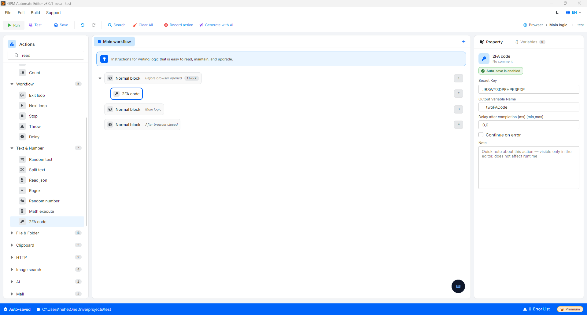

# 2fa code

2fa code 是一个用于根据提供的原始安全密钥,自动生成随时间变化的六位数双重验证码(类似手机上的 Google Authenticator 或 Authy 应用)的操作。

该操作在 MMO 场景中极其重要,可以帮助自动通过登录 Facebook、Google、X(Twitter)、Discord、Coinlist 等账户时的安全验证步骤,而无需打开手机手动输入。

🎥 查看更多教程视频:[点击这里](https://youtu.be/nlEQsaxawt4)。

#### 配置参数:

* Secret key:原始安全密钥(一串较长的字母和数字组合,通常在您于网站上开启双重验证安全功能时获得)。
* Output variable:用于存储生成的六位数验证码的变量名称。

#### 实际示例:登录 Facebook 时自动填写 2FA 验证码

假设您在 Excel 中保存了一个 Facebook 账户的数据,其中该账户的双重验证密钥(Secret key)列的值为:`JBSWY3DPEHPK3PXP`。

当浏览器跳转到 Facebook 登录页面,填写完用户名/密码后,Facebook 会要求输入六位数验证码才能进入账户。您可以按照以下方式配置自动处理流程:

* 配置方法:
  * 调用 2fa code 操作。
  * Secret key:填入字符串 `JBSWY3DPEHPK3PXP`(或传入从 Excel 文件读取出的包含该字符串的变量)。
  * Output variable:将变量命名为 `$twoFACode`。
* 结果:系统会根据时间加密算法立即计算出当前的六位数验证码(例如:`482915`)并存入 `$twoFACode` 变量中。在此操作之后,您可以继续调用 Key press 命令,将 `$twoFACode` 变量传入 Facebook 的验证码输入框中,即可成功登录。

<figure><figcaption></figcaption></figure>