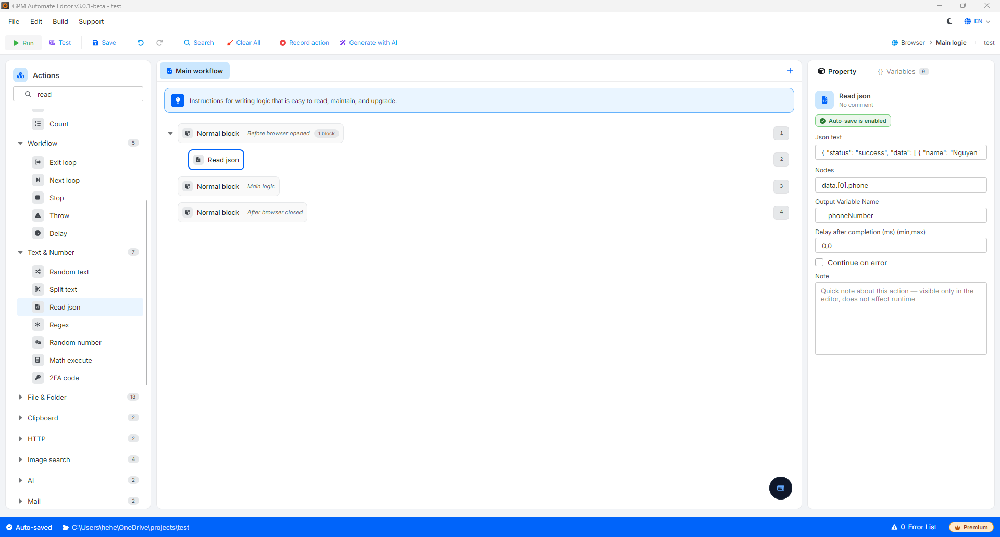

# Read json

Read json 用于根据指定的路径结构从一段 JSON 格式的文本中提取数值。

🎥 观看更多指导视频:[点击这里](https://youtu.be/nlEQsaxawt4)。

#### 配置参数:

* JSON Text: 需要读取的输入 JSON 文本字符串(或包含 JSON 字符串的变量)。
* Nodes: 指向包含所需数据的 key 的路径(JSON Path)。

#### 实际示例: 从数据列表中获取电话号码

假设您有一个包含客户信息列表的 JSON 字符串,如下所示:

JSON

```
{
  "status": "success",
  "data": [
    {
      "name": "Nguyen Van A",
      "phone": "0987654321"
    },
    {
      "name": "Le Minh C",
      "phone": "0123456789"
    }
  ]
}
```

要提取列表中第一个人的电话号码,您需要配置 Read json 动作:

* JSON Text: 填入上述 JSON 字符串(或传入包含该字符串的变量)。
* Nodes: 填入 `data.[0].phone` _(其中 `data` 进入数据数组,`[0]` 是第一个人的位置,`phone` 是需要获取的属性)_。
* Output variable: 填入用于保存结果的变量名(例如:`$phoneNumber`)。

结果: 变量 `$phoneNumber` 将获得值 `"0987654321"`。

<figure><figcaption></figcaption></figure>