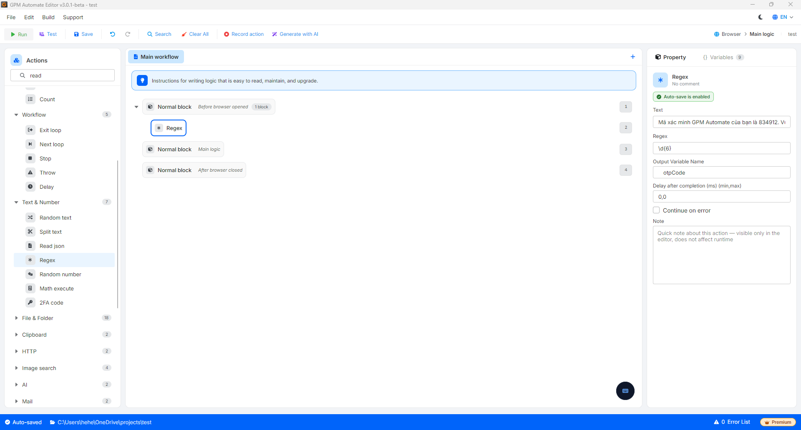

# Regex

Regex（Regular Expression）就像一个放大镜，帮助您在一大段文本中精确搜寻隐藏的某段文字，或者像一个过滤网，帮助您保留自己需要的确切数据格式（如电话号码、邮箱、OTP验证码），并去除周围多余的文字部分。

🎥 查看更多教程视频：[点击这里](https://youtu.be/nlEQsaxawt4)。

#### 配置参数：

* Text：需要过滤数据的原始输入文本（或包含该文本段的变量）。
* Regex：用于定义需要提取字符串结构的过滤器代码/语法。
* Output variable：成功过滤后用于保存结果的变量名称。

#### 实际示例：从邮件内容中提取OTP验证码

当您使用 Mail 读取操作时，系统会返回一长串杂乱的邮件文本内容。您的任务是从中准确找出由6位数字组成的OTP验证码。

假设收到的输入 Text 段为：

> "您的 GPM Automate 验证码是 834912。请勿将此代码分享给任何人，该代码在5分钟内有效。"

要过滤提取出6位OTP数字，您可以按如下方式配置 Regex 操作：

* Text：传入上述文本段（或包含邮件内容的变量）。
* Regex：填入 `\d{6}`_（这是代表6个连续数字字符的正则表达式语法）_。
* Output variable：填入需要保存的变量名称（例如：`$otpCode`）。

结果：Regex这个"过滤网"将扫描整段文本，跳过所有越南语文字部分，并精确保留字符串 `834912`，赋值给变量 `$otpCode`。

> 💡 小提示：Regex语法看起来很复杂难记？别担心，您完全不需要费心去死记硬背。您可以打开AI工具（如ChatGPT、DeepSeek、Gemini等），用自然语言直接提问，例如：_"帮我写一段正则表达式来过滤6个连续数字"_ 或 _"写一个正则表达式提取位于'您的验证码是：'和句号之间的字符串"_。AI会为您生成准确的代码，您只需复制粘贴到 GPM Automate 的配置框中即可。

<figure><figcaption></figcaption></figure>