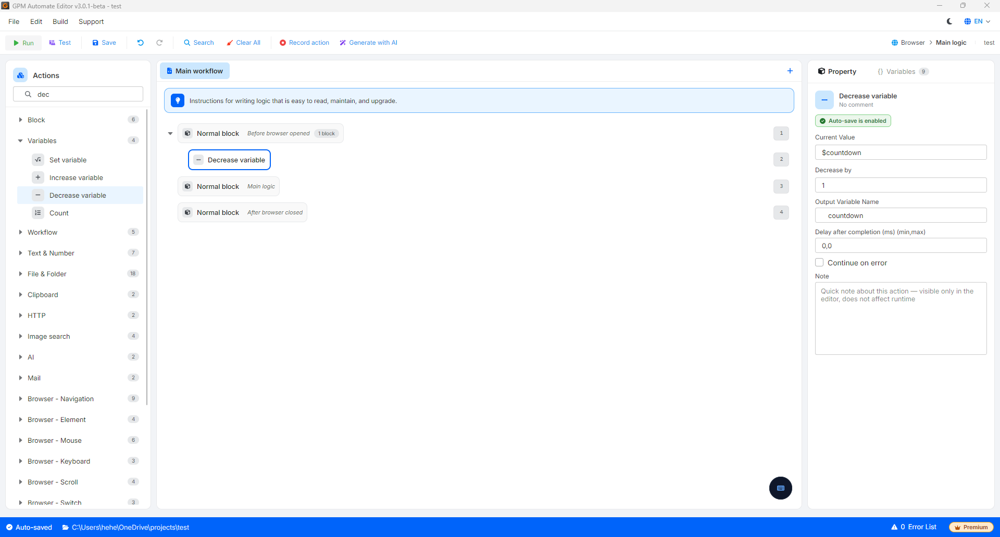

# Decrease variable

在 Output variable（输出变量）栏中，您可以填写与旧变量相同的名称以进行累减，或填写一个完全不同的变量名称以将结果保存到新变量中，而不改变旧变量的值。

* Decrease by：想要减去的数量（例如：`1`、`2`、`5`……）。
*   例如：您有一个变量 `$countdown = 10`。

    * 如果 _Output variable_ 填写为 `$countdown`，_Decrease by_ 填写为 `1` ➡️ 变量 `$countdown` 将减少为 `9`（累减）。
    * 如果 _Output variable_ 填写为 `$previousRow`，_Decrease by_ 填写为 `1` ➡️ 变量 `$countdown` 仍保持为 `10`，而新变量 `$previousRow` 的值将为 `9`。

    🎥 观看更多教学视频：[点击这里](https://youtu.be/nlEQsaxawt4)。

<figure><figcaption></figcaption></figure>