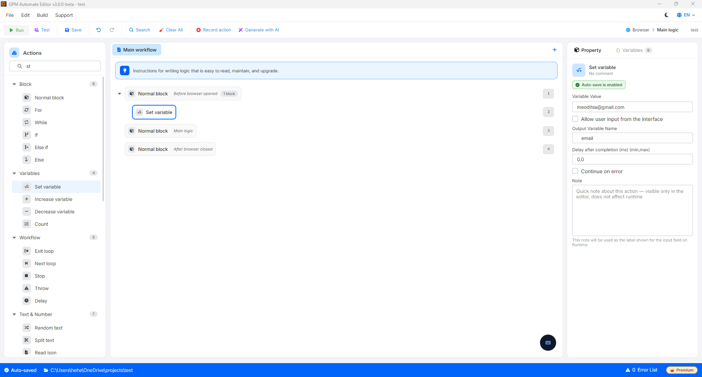
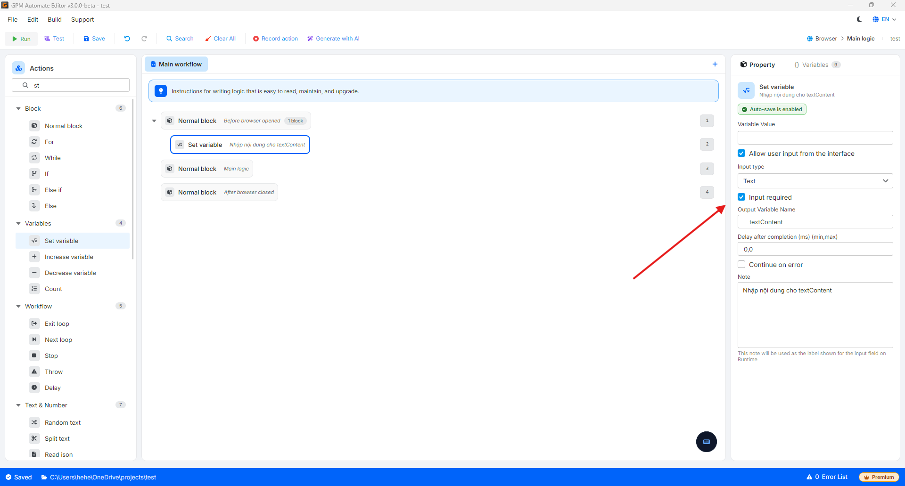
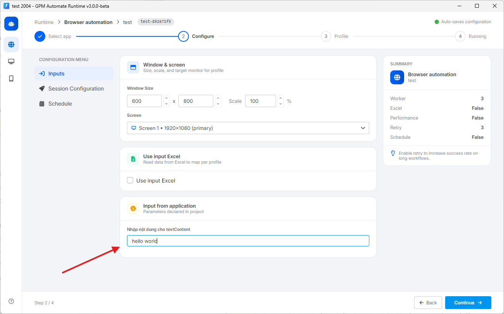
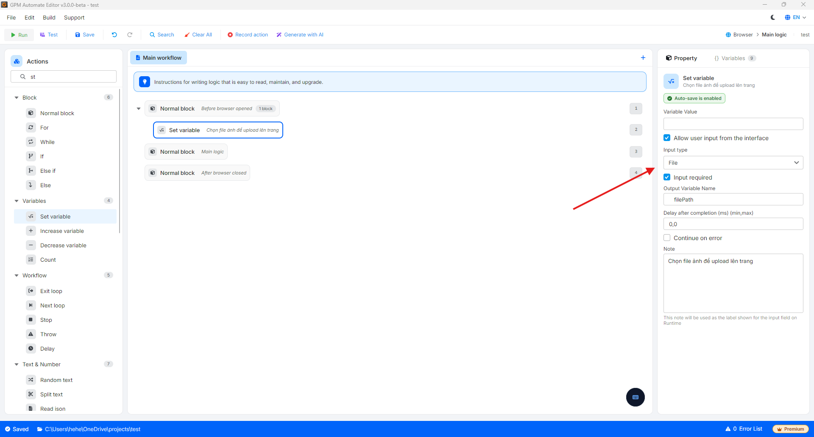
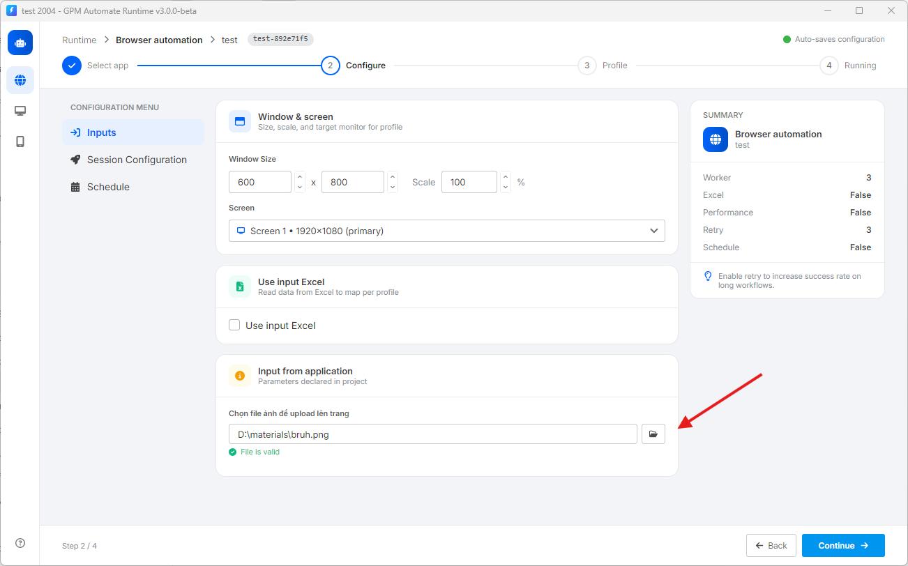
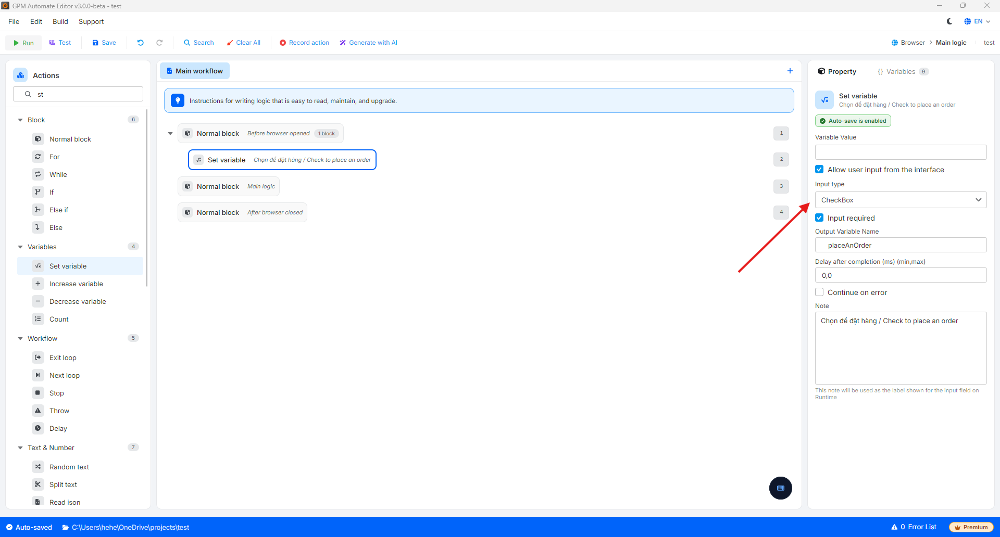
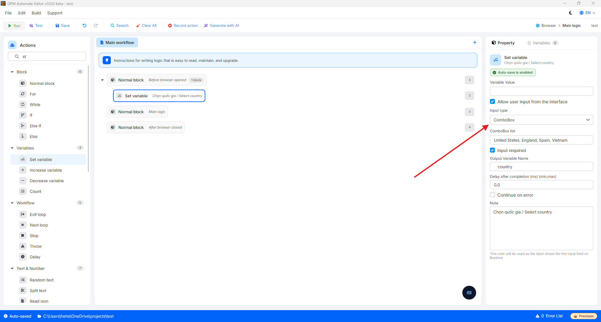
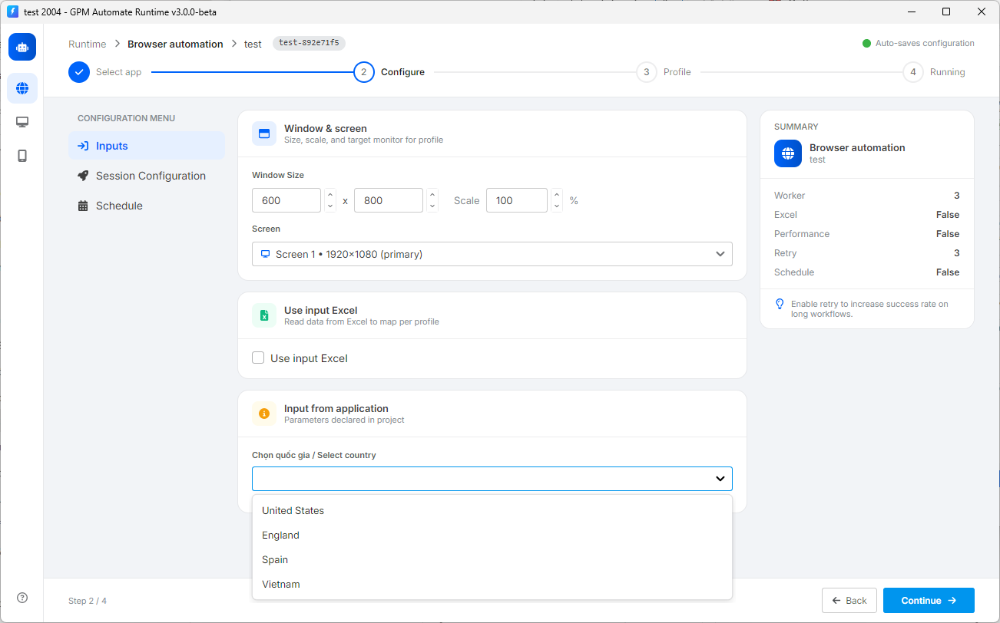

# Set variable

这是用于在脚本中新建或更改变量（数据容器）值的操作。此外，该操作还允许您在主界面上创建输入框，帮助用户在开始运行工具之前自行填写信息。

* 允许输入（Allow user input from the interface）：勾选此项以在主界面上创建空白输入框，允许用户在点击运行前直接向脚本中输入数值。
* 必须输入（Input required）：选择此项后，系统会要求用户必须填满数据或选择文件才能点击运行按钮。如果留空，工具会立即报错，以避免因忘记输入信息而导致误运行的情况。

🎥 查看更多操作指南视频：[点击这里](https://youtu.be/nlEQsaxawt4)。

<figure><figcaption></figcaption></figure>

系统在界面上支持4种输入数据类型（Input Type），包括：

#### 1. 文字输入类型（Text）

用于当您希望用户从键盘自行输入字符串、文本或数字值时使用。

* 实际示例：您将变量命名为 `$textContent`。当用户在界面上的输入框中输入内容 `"hello world"` 时，此时变量 `$textContent` 的值将为 `"hello world"`（`$textContent = "hello world"`）。

<figure><figcaption></figcaption></figure>

<figure><figcaption></figcaption></figure>

#### 2. 文件选择类型（File）

用于当脚本需要处理运行者电脑上的特定文件时使用（如图片文件、数据文件、配置文件等）。在UI界面上会出现一个文件夹图标按钮，供用户点击并浏览查找文件。

* 实际示例：用户点击选择位于D盘中的文件 `bruh.png`。收到的变量 `$filePath` 值将为该文件的绝对路径：`"D:\materials\bruh.png"`（`$filePath = "D:\materials\bruh.png"`）。您可以立即获取此 `$filePath` 变量，并在后续步骤中传入 File upload 操作。

<figure><figcaption></figcaption></figure>

<figure><figcaption></figcaption></figure>

#### 3. 勾选类型（Checkbox）

Checkbox是允许用户开启或关闭一个二元选项（是/否，开/关，同意/不同意）的界面组件。

* 特点：当被勾选时，变量将获得值 `True`。当取消勾选时，变量将获得值 `False`。
* 实际示例：您创建一个标签为 _"Chọn để đặt hàng / Check to place an order"_ 的项目，并将其关联到变量 `$checkBox`。如果用户勾选此框，变量 `$checkBox` 将获得值 `True`（`$checkBox = True`）。您可以使用 If 代码块进行检查：仅当 `$checkBox = True` 时才执行付款步骤。

<figure><figcaption></figcaption></figure>

#### 4. 选择列表类型（Combo Box）

Combo Box（类似于Dropdown）是一种显示现有选项列表的界面组件，允许用户在某一时刻选择唯一一个值。此功能有助于最大限度地减少输入拼写错误或数据格式错误的情况。

* 特点：有助于在需要选择固定信息时保持数据的一致性，如国家、行业、产品类型、活动状态等。
* 实际示例：您配置了一个包含多个国家的列表，并关联到变量 `$country`。当用户打开脚本并从下拉列表中选择 `"United States"` 时，Automate中的变量 `$country` 将立即获得值 `"United States"`（`$country = "United States"`）。

<figure><figcaption></figcaption></figure>

<figure><figcaption></figcaption></figure>