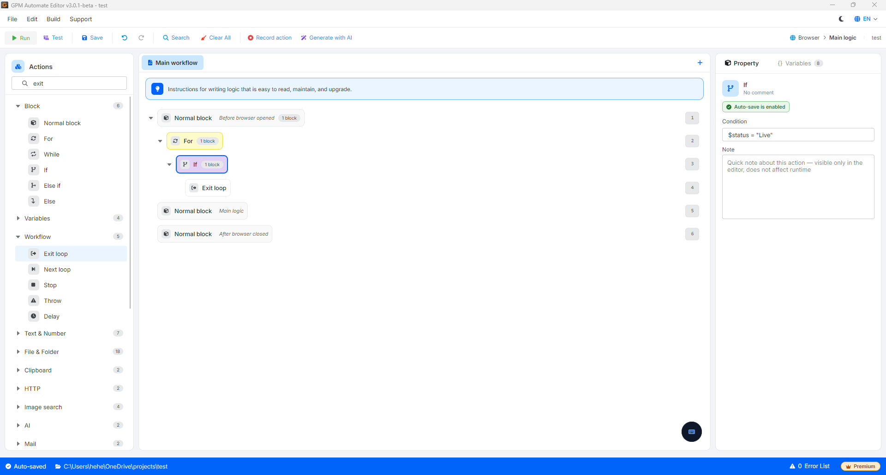

# Exit loop

Exit loop is the action used to forcefully exit the current loop (For or While) immediately, regardless of whether the loop has completed its designated iterations. After exiting, the system will continue to execute the actions immediately following that loop block.

This action is often placed within an If conditional block to handle unusual situations or when the necessary result has been found ahead of time.

#### Practical example: Stop checking when a valid account is found

Suppose you use a For loop to scan through a list of 100 accounts in an Excel file to find an account with the status of `"Live"` to use. If row number 5 is already a "Live" account, you do not need to waste time running through the remaining 95 rows.

* Configuration steps:
  * Inside the For block, you use an If statement to check: `If status = "Live"`.
  * In that If block, you handle retrieving the account and then call the Exit loop action.
* Result: The system runs to row number 5, sees the condition is true, immediately jumps out of the For loop, and continues executing the actions below to proceed with the work.

<figure><figcaption></figcaption></figure>