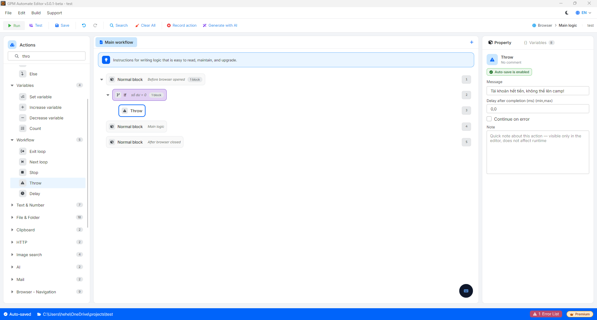
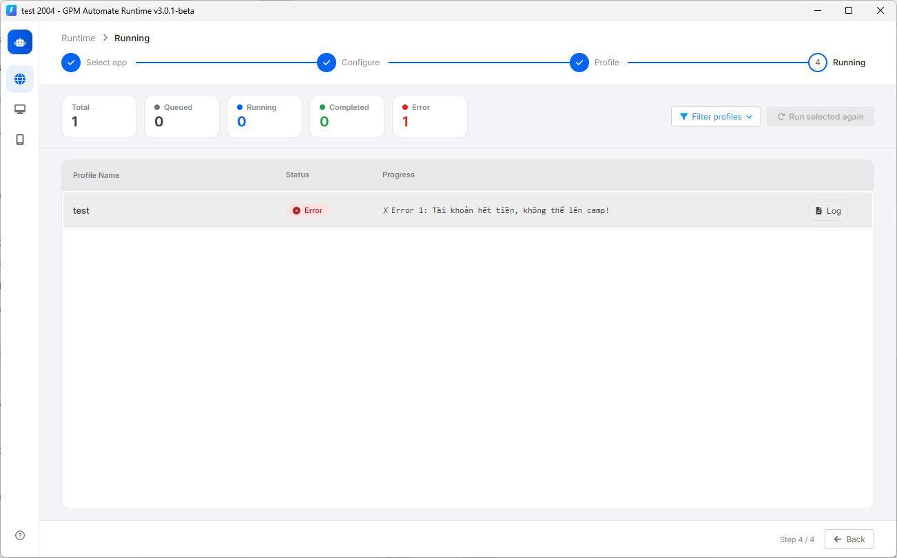

# Throw

Throw 是用于主动抛出一个由您自行定义的错误提示（Exception）并立即停止当前脚本流程的操作。

Throw 与 Stop 之间的核心区别在于流程停止后的报告状态：

* Stop：关闭流程，系统仍会记录为运行完成状态（Completed - 显示绿色）。
* Throw：关闭流程，系统会将状态标记为出现错误（Error - 标红），并在系统日志（Log）中附上具体的错误内容。

#### 实际示例：广告账户余额不足时抛出错误

假设您正在制作一个自动创建广告活动的脚本。在进行设置之前，脚本需要进入管理页面检查预算。如果余额为 0，脚本就无法继续运行：

* 配置方法：
  * 使用 If 代码块进行检查：`如果 余额 = 0`。
  * 在 If 代码块内部，调用 Throw 操作并填写错误提示内容为：`"错误：账户余额不足，无法创建广告活动！"`。
* 结果：当运行到此处时，该 Profile 的流程会立即关闭。在 GPM Automate 的进度管理表中，该 Profile 所在的行会转变为 Error 状态（标红），并附带错误提示文字。您只需浏览一下列表，即可立即筛选出哪些账户出现错误需要处理，而不会与运行成功的流程（Completed）混淆。

<figure><figcaption></figcaption></figure>

<figure><figcaption></figcaption></figure>