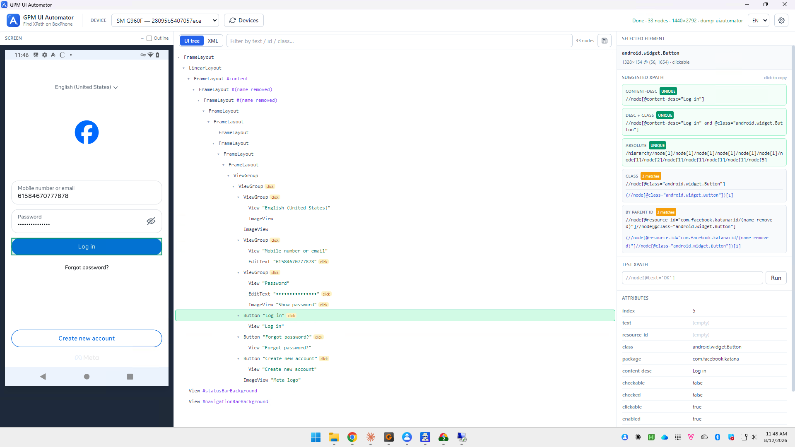
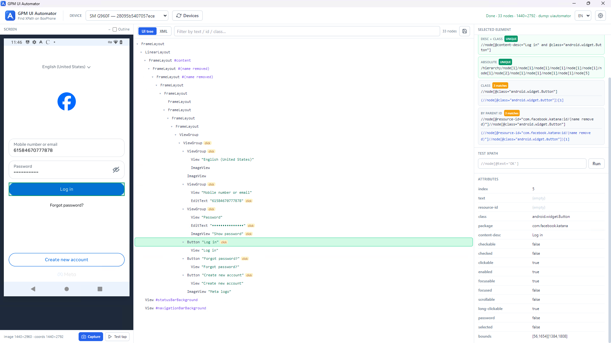

# Hướng dẫn xác định XPath & toạ độ

Nhiều action trong nhóm Phone - Action và Phone - Element cần trỏ tới một phần tử trên màn hình điện thoại thông qua **XPath** hoặc **toạ độ**. Bạn dùng công cụ **GPM UI Automator** (Find XPath on BoxPhone) để lấy các giá trị này.

#### Các bước thực hiện:

1. Chọn thiết bị ở ô DEVICE (ví dụ `SM G960F`). Bấm Devices để làm mới danh sách nếu chưa thấy máy.
2. Mở đúng màn hình cần thao tác trên điện thoại, rồi bấm Capture để chụp và dựng lại cây giao diện. Có thể xem dạng cây (UI tree) hoặc mã (XML), lọc nhanh bằng ô Filter by text / id / class.
3. Bấm chọn phần tử cần lấy — trong cây hoặc ngay trên ảnh màn hình bên trái. Phần tử được chọn sẽ sáng lên và hiện thông tin ở khung SELECTED ELEMENT bên phải.

<figure><figcaption></figcaption></figure>

#### Lấy XPath:

Khung SUGGESTED XPATH gợi ý sẵn nhiều kiểu XPath kèm nhãn cho biết mức độ chính xác:

* `UNIQUE`: chỉ khớp đúng 1 phần tử — nên ưu tiên dùng để chạy ổn định.
* `n matches`: khớp nhiều phần tử, cần cân nhắc trước khi dùng.

Các kiểu gợi ý gồm: CONTENT-DESC, DESC + CLASS, ABSOLUTE, CLASS, BY PARENT ID. Bấm "click to copy" để sao chép XPath, rồi dán vào ô XPath của action. Có thể kiểm tra lại bằng ô TEST XPATH rồi bấm Run.

#### Lấy toạ độ:

Khung ATTRIBUTES hiển thị thuộc tính của phần tử, trong đó `bounds` là toạ độ khung dạng `[x1,y1][x2,y2]`. Toạ độ tâm phần tử là trung điểm của khung này. Bấm Test tap để thử chạm vào phần tử nhằm kiểm tra.

<figure><figcaption></figcaption></figure>
