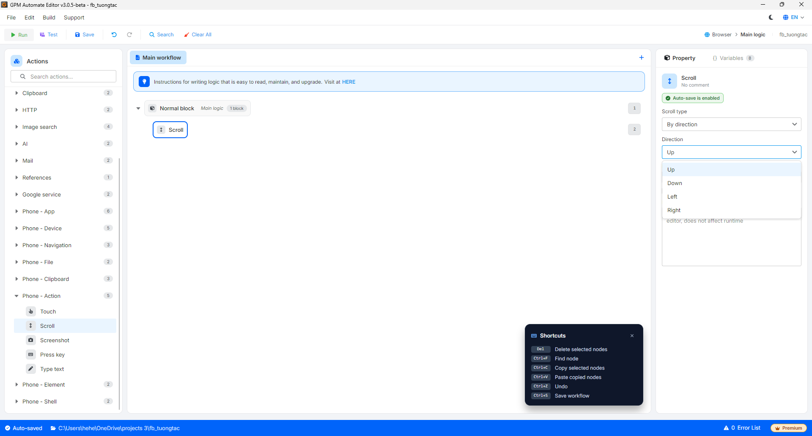
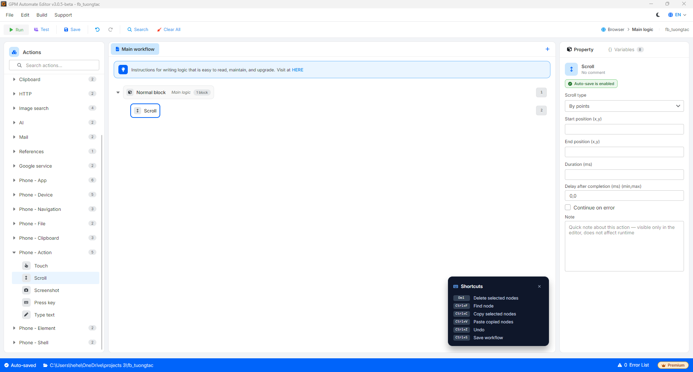

# Scroll

Scroll là hành động cuộn/vuốt màn hình thiết bị điện thoại. Hỗ trợ hai kiểu: cuộn theo hướng cố định, hoặc vuốt từ một điểm đến một điểm khác theo toạ độ.

#### Giải thích các tham số cấu hình:

* Scroll type: Kiểu cuộn:
  * `By direction`: cuộn theo hướng cố định.
  * `By points`: vuốt từ điểm đầu đến điểm cuối theo toạ độ.
* Direction: (khi chọn By direction) Hướng cuộn — `Up`, `Down`, `Left`, `Right`.
* Start position (x,y): (khi chọn By points) Toạ độ điểm bắt đầu vuốt, ví dụ `500,1500`.
* End position (x,y): (khi chọn By points) Toạ độ điểm kết thúc vuốt, ví dụ `500,500`.
* Duration (ms): (khi chọn By points) Thời gian thực hiện cú vuốt tính bằng mili-giây; số càng lớn thì vuốt càng chậm.

<figure><figcaption>
Scroll by direction
</figcaption></figure>

<figure><figcaption>
Scroll by points
</figcaption></figure>
