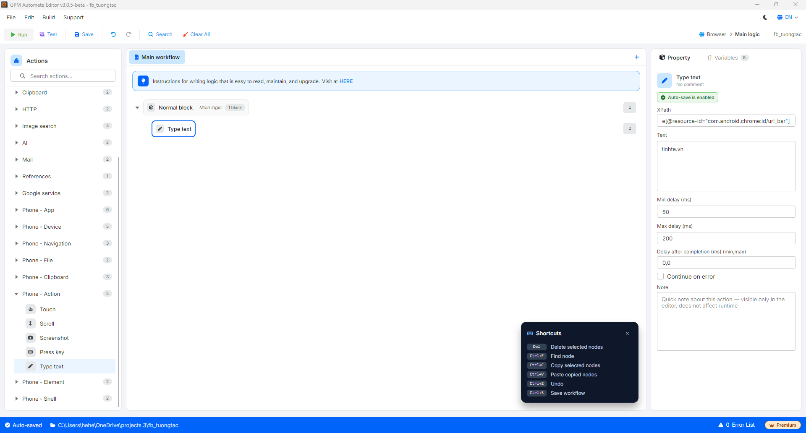

# Type text

Type text là hành động nhập (gõ) một đoạn văn bản vào ô nhập liệu được xác định bằng XPath, mô phỏng gõ từng ký tự với độ trễ ngẫu nhiên để giống thao tác của người thật.

#### Giải thích các tham số cấu hình:

* XPath: XPath của ô nhập liệu cần gõ vào, ví dụ `//node[@resource-id="com.android.chrome:id/url_bar"]`. Xem cách lấy XPath tại [Hướng dẫn xác định XPath & toạ độ](huong-dan-xac-dinh-xpath-va-toa-do.md).
* Text: Nội dung văn bản cần gõ, ví dụ `tinhte.vn`.
* Min delay (ms): Độ trễ tối thiểu giữa các ký tự (mili-giây), ví dụ `50`.
* Max delay (ms): Độ trễ tối đa giữa các ký tự (mili-giây), ví dụ `200`. Mỗi ký tự sẽ được chờ một khoảng ngẫu nhiên giữa min và max.

<figure><figcaption></figcaption></figure>
