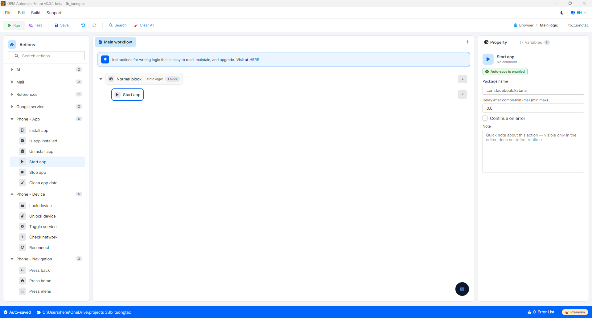

# Start app

Start app là hành động mở và đưa một ứng dụng đã cài lên chạy ở màn hình trước (foreground), tương đương thao tác chạm vào biểu tượng ứng dụng.

#### Giải thích các tham số cấu hình:

* Package name: Tên gói của ứng dụng cần mở, ví dụ `com.facebook.katana`.

<figure><figcaption></figcaption></figure>
